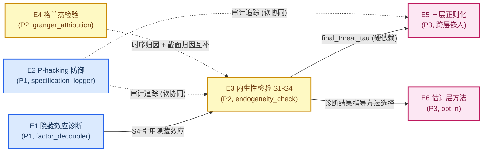

# v3.1.0 执行方案 — 内生性诊断与正则化框架 v1.0

> **版本**: v1.0 (2026-07-08)
> **范围**: 基于 [DESIGN_DISCUSSION_V3.1.0.md v1.3](private/DESIGN_DISCUSSION_V3.1.0.md) 的可执行工程实施方案
> **前置**: v3.0.0 T1 (21 维指纹) + T3 (CUSUM 漂移监测) + T4 (BH-FDR 多重检验) 已完成
> **方法**: 与 v3.0.0 一致的 E1-E3 三阶段 TDD 流程, 严格 Red→Green→Review
> **认识论立场**: 与设计文档一致 — 测量可信度, 不声称发现; 统计服务测量, 非叙事辩护

---

## 0. 摘要

### 0.1 目标

将 [DESIGN_DISCUSSION_V3.1.0.md v1.3](private/DESIGN_DISCUSSION_V3.1.0.md) 五个设计主题工程化为 **6 个独立交付任务 (E1-E6)**, 覆盖内生性诊断全链路 (插补前 → 解耦后) + P-hacking 防御 + 格兰杰归因 + 三层正则化 + 估计层缓解方法。

### 0.2 五主题 → 六任务映射

| 任务 | 设计章节 | 主题 | 优先级 | 嵌入路径 | 依赖 |
|------|----------|------|--------|----------|------|
| **E1** | §2 | 隐藏效应诊断 (HiddenEffectDiagnosticMixin 嵌入 factor_decoupler) | P1 | 嵌入现有模块 | 无 (是 E3 S4 的上游) |
| **E2** | §3 | P-hacking 防御 L1-L2 (SpecificationLogger 独立基础设施) | P1 | 独立新模块 + 扩展 multiple_testing.py | 无 |
| **E3** | §1 | 内生性检验 S1-S4 (Oster δ / AET / IFE / Lewbel + Orchestrator) | P2 | 独立新模块 `modules/endogeneity_check/` | E1 (S4 引用隐藏效应诊断) |
| **E4** | §4 | 格兰杰检验 (TodaYamamotoGrangerTester + Bootstrap) | P2 | 独立新模块 `backtest/granger_attribution/` | 无 |
| **E5** | §5 | 三层决策正则化 (L1 DualNeutralizer + L2 factor_significance + L3 optimizer) | P3 | 跨层嵌入现有模块 | **E3** (硬依赖 `final_threat_tau`) |
| **E6** | §5 | 估计层方法 (Profile GMM / IVX / Regularized DOLS / PFGMM) | P3 | 独立新模块, opt-in | E3 (诊断结果指导方法选择) |

### 0.3 依赖关系图



### 0.4 版本规划

| 阶段 | 任务 | 测试数 (估计) | 关键产出 |
|------|------|---------------|----------|
| **P1** | E1 + E2 | ~38 | HiddenEffectDiagnosticMixin + SpecificationLogger + BY-FDR 扩展 |
| **P2** | E3 + E4 | ~59 | EndogeneityDiagnosticOrchestrator (S1-S4) + TodaYamamotoGrangerTester |
| **P3** | E5 + E6 | ~30 | 三层正则化 (L1+L2+L3) + 4 个估计器 (Profile GMM / IVX / DOLS / PFGMM) |

### 0.5 核心工程约束

1. **默认 `enable=False`**: 所有新配置字段默认关闭, 显式 opt-in, 与 v3.0.0 T1/T3 一致 (ADR-024)
2. **诊断优先于校正**: 测量威胁大小, 不声称消除威胁 (与 §3 前置处理诚实性框架一致)
3. **sklearn-style 接口**: 所有新模块遵循 `fit/transform/get_diagnostics` 接口契约
4. **事后诊断不侵入 fit/transform**: 与 v3.0.0 T3 `monitor_cusum_drift` 模式一致
5. **最小依赖**: 优先复用 v3.0.0 已实施的 BH-FDR / CUSUM / 21 维指纹基础设施
6. **TDD 严格模式**: Red → Green → Review, 每个任务独立交付
7. **独立交付**: E1-E6 互不阻塞 (除 E5→E3 硬依赖), 可并行开发
8. **v1.3 术语严格**: Oster δ (非 ITCV), R_max = 1.3 × R̃ (非 2.75), IVX 指数衰减滤波 (非分数差分), Profile GMM (Hong-Su-Jiang 2022, 非以 NNR+GMM 为正式术语), IFE `lambda_i' * F_t` (Bai 2009), Lewbel `Z_internal = (Z - Z̄) × ê²`, PFGMM (Ghosh-Thoresen 2019), 因子增强 IVX 暂不使用, Hausman 递进而非并列, S2-S1 上下文衔接非数值差分

### 0.6 v3.0.0 兼容性概览

| v3.0.0 基线 | v3.1.0 复用方式 |
|-------------|-----------------|
| T1: 21 维 FactorFingerprint | E1 隐藏效应诊断引用 `ar1_median` / `half_life` 判断解耦方法适用性 |
| T3: CUSUM 漂移监测 (post-hoc) | E1/E3/E4 遵循同样的 post-hoc 诊断模式 (`check_xxx` 方法, 不侵入 fit/transform) |
| T4: BH-FDR 多重检验共享模块 | E2 扩展 `apply_by_fdr` (BY-FDR 稳健性), E5 L2 分层 α + 层内 BH-FDR |
| PipelineV2Config (dataclass, enable=False 默认) | E1-E6 全部以 `enable_xxx: bool = False` 字段扩展 |
| ADR-024 (opt-in 原则) | 所有新功能遵循 ADR-024, 默认行为与 v3.0.0 完全一致 |

---

## 1. E1 — §2 隐藏效应诊断 (P1)

### 1.1 设计意图

时序解耦 (AR / 差分 / HP 滤波) 将水平值内生性**转移**到增量上, 而非**消除**。AR 残差 η_t 仍包含 X_t 的线性组合: `η_t = β·(X_t - φ·X_{t-1}) + (u_t - φ·u_{t-1})`。E1 提供 4 类诊断, 嵌入 `factor_decoupler` 作为 Mixin, 不侵入现有 `fit/transform` 接口。

### 1.2 代码改动位置

| 文件 | 类/方法 | 改动类型 | 行号参考 |
|------|---------|----------|----------|
| `modules/factor_decoupler/diagnostics/hidden_effect.py` | `HiddenEffectDiagnosticMixin` (新) | 新建 | — |
| `modules/factor_decoupler/core/dual_neutralizer.py` | `CompositeDecoupler` (L314) | 扩展基类 | `class CompositeDecoupler(HiddenEffectDiagnosticMixin, BaseDecoupler):` |
| `modules/factor_decoupler/core/ar_model.py` | `ARDecoupler` (L205) | 扩展基类 | `class ARDecoupler(HiddenEffectDiagnosticMixin, BaseAR):` |
| `pipelines_v2.py` | `FactorProcessingPipelineV2` (L1044) | 新增方法 | `def diagnose_hidden_effects(self, factor_data, controls=None, returns=None):` |
| `pipelines_v2.py` | `PipelineV2Config` (L681) | 新增字段 | `enable_hidden_effect_diagnosis: bool = False` |

### 1.3 算法实现

#### 1.3.1 Mixin 类签名

```python
# modules/factor_decoupler/diagnostics/hidden_effect.py
from typing import Dict, Any, Optional
import numpy as np
import pandas as pd
from scipy import stats as scipy_stats


class HiddenEffectDiagnosticMixin:
    """时序解耦隐藏效应诊断 Mixin (§2).

    嵌入 CompositeDecoupler / ARDecoupler, 提供:
    1. 增量内生性诊断: Cov(η_t, X_t - φ·X_{t-1}) ≠ 0?
    2. 信息损失诊断: IC 衰减比例 (signal_lost / noise_removed / ambiguous)
    3. 平稳性 vs 内生性分离: ADF 通过 ≠ 内生性消除
    4. 方法敏感性: AR / 差分 / HP 滤波 IC 一致性

    不侵入 fit/transform, 仅扩展 diagnose_hidden_effects 诊断方法.
    """

    def diagnose_hidden_effects(
        self,
        factor_data: pd.DataFrame,
        controls: Optional[pd.DataFrame] = None,
        returns: Optional[pd.DataFrame] = None,
    ) -> Dict[str, Any]:
        """时序解耦隐藏效应诊断 (post-hoc, 不修改 self 状态).

        两阶段分离 (v1.3 修正):
        - **fit 阶段**: 模型估计 (AR 系数 / 滤波参数), 不做 post-hoc 分析.
        - **post-hoc 阶段**: 在 fit 完成后调用本方法, 用已估计的模型做隐藏效应检测.
          本方法调用 self.transform() (复用已拟合模型) 但不修改 fit 状态.
        - 两阶段严格分离: 必须先 fit, 再 diagnose; 不可在 fit 阶段混合 post-hoc 分析.

        Args:
            factor_data: 原始因子数据 (T, N)
            controls: 行业/市值控制变量 (T, N, K), 用于增量内生性检验
            returns: 未来收益 (T, N), 用于 IC 衰减对比

        Returns:
            {
                'incremental_endogeneity': {...},
                'information_loss': {...},
                'stationarity_vs_endogeneity': {...},
                'method_sensitivity': {...},
            }

        Raises (软处理):
            若模型未 fit, 返回各诊断含 'model not fitted' 提示, 不抛异常.
        """
        # 显式 fitted 状态守卫: post-hoc 诊断依赖已拟合的模型参数
        # (ar_coefficients_ / 滤波参数). 未 fit 时各子诊断降级提示.
        is_fitted = (
            getattr(self, 'ar_coefficients_', None) is not None
            or getattr(self, 'fitted_', False)
        )
        if not is_fitted:
            return {
                'incremental_endogeneity': {
                    'diagnostic': 'model not fitted — 必须先 fit, 再做 post-hoc 诊断 (两阶段分离)',
                    'is_incremental_endogenous': False,
                },
                'information_loss': {
                    'diagnostic': 'model not fitted — transform 不可用, 跳过 IC 衰减诊断',
                    'interpretation': 'undefined',
                },
                'stationarity_vs_endogeneity': {
                    'diagnostic': 'model not fitted — 跳过增量内生性检验',
                    'warning': '必须先 fit, 再做 post-hoc 诊断 (两阶段分离)',
                },
                'method_sensitivity': {
                    'diagnostic': 'model not fitted — transform 不可用, 跳过方法敏感性诊断',
                    'consistency': 'undefined',
                },
            }

        result: Dict[str, Any] = {}
        result['incremental_endogeneity'] = self._diagnose_incremental_endogeneity(
            factor_data, controls
        )
        result['information_loss'] = self._diagnose_information_loss(
            factor_data, returns
        )
        result['stationarity_vs_endogeneity'] = self._diagnose_stationarity_vs_endogeneity(
            factor_data, controls
        )
        result['method_sensitivity'] = self._diagnose_method_sensitivity(
            factor_data, returns
        )
        return result
```

#### 1.3.2 诊断 1: 增量内生性

**数学公式**:

AR(1) 残差 `η_t = f_t - φ·f_{t-1}`, 控制变量增量 `ΔX_t = X_t - φ·X_{t-1}`。

增量内生性指标: `cov_eta_delta_X = Cov(η_t, ΔX_t)`, 显著性通过 t 检验判断。

```python
def _diagnose_incremental_endogeneity(
    self,
    factor_data: pd.DataFrame,
    controls: Optional[pd.DataFrame],
) -> Dict[str, Any]:
    """诊断 1: 增量内生性 — AR 残差是否仍包含 X_t 的变换.

    数学: η_t = f_t - φ·f_{t-1}; ΔX_t = X_t - φ·X_{t-1}
    检验: Cov(η_t, ΔX_t) ≠ 0? (t 检验 p < 0.05)
    """
    if controls is None:
        return {'cov_eta_delta_X': float('nan'), 'is_incremental_endogenous': False,
                'diagnostic': 'no controls provided'}

    phi = getattr(self, 'ar_coefficients_', None)
    if phi is None:
        return {'cov_eta_delta_X': float('nan'), 'is_incremental_endogenous': False,
                'diagnostic': 'AR model not fitted'}

    phi_1 = phi[0] if hasattr(phi, '__len__') else phi

    factor_arr = factor_data.values
    eta = factor_arr[1:] - phi_1 * factor_arr[:-1]

    controls_arr = controls.values if hasattr(controls, 'values') else controls
    delta_x = controls_arr[1:] - phi_1 * controls_arr[:-1]

    n_min = min(eta.shape[1], delta_x.shape[1])
    eta_aligned = eta[:, :n_min]
    delta_x_aligned = delta_x[:, :n_min]

    covs = []
    for j in range(n_min):
        valid = ~(np.isnan(eta_aligned[:, j]) | np.isnan(delta_x_aligned[:, j]))
        if valid.sum() < 10:
            continue
        cov_j = np.cov(eta_aligned[valid, j], delta_x_aligned[valid, j])[0, 1]
        covs.append(cov_j)

    if not covs:
        return {'cov_eta_delta_X': float('nan'), 'is_incremental_endogenous': False,
                'diagnostic': 'insufficient valid samples'}

    cov_mean = float(np.mean(covs))
    t_stat, p_value = scipy_stats.ttest_1samp(covs, 0.0)
    is_endogenous = bool(p_value < 0.05 and abs(cov_mean) > 1e-6)

    return {
        'cov_eta_delta_X': cov_mean,
        't_statistic': float(t_stat),
        'p_value': float(p_value),
        'is_incremental_endogenous': is_endogenous,
        'diagnostic': (
            'incremental_endogeneity_detected' if is_endogenous
            else 'no_incremental_endogeneity'
        ),
    }
```

#### 1.3.3 诊断 2: 信息损失 (IC 衰减)

**数学公式**:

`ic_decay_ratio = IC_after / IC_before`

- `ic_decay_ratio > 0.9`: `noise_removed` (解耦几乎无损信号)
- `ic_decay_ratio < 0.5`: `signal_lost` (解耦丢失信号)
- 其他: `ambiguous`

```python
def _diagnose_information_loss(
    self,
    factor_data: pd.DataFrame,
    returns: Optional[pd.DataFrame],
) -> Dict[str, Any]:
    """诊断 2: 信息损失 — 解耦前后 IC 衰减比例."""
    if returns is None:
        return {'ic_before': float('nan'), 'ic_after': float('nan'),
                'ic_decay_ratio': float('nan'), 'interpretation': 'no returns provided'}

    ic_before = self._compute_cross_sectional_ic_mean(factor_data, returns)

    try:
        decoupled = self.transform(factor_data)
        ic_after = self._compute_cross_sectional_ic_mean(decoupled, returns)
    except Exception:
        return {'ic_before': ic_before, 'ic_after': float('nan'),
                'ic_decay_ratio': float('nan'), 'interpretation': 'transform failed'}

    if abs(ic_before) < 1e-10 or np.isnan(ic_before) or np.isnan(ic_after):
        ratio = float('nan')
        interpretation = 'undefined'
    else:
        ratio = float(ic_after / ic_before)
        if ratio > 0.9:
            interpretation = 'noise_removed'
        elif ratio < 0.5:
            interpretation = 'signal_lost'
        else:
            interpretation = 'ambiguous'

    return {
        'ic_before': float(ic_before),
        'ic_after': float(ic_after),
        'ic_decay_ratio': ratio,
        'interpretation': interpretation,
    }

@staticmethod
def _compute_cross_sectional_ic_mean(factor: pd.DataFrame, returns: pd.DataFrame) -> float:
    """计算截面 IC 均值 (Spearman 秩相关)."""
    n_periods = factor.shape[0]
    ics = []
    for t in range(n_periods):
        f_t = factor.iloc[t]
        r_t = returns.iloc[t]
        valid = ~(f_t.isna() | r_t.isna())
        if valid.sum() < 5:
            continue
        corr, _ = scipy_stats.spearmanr(f_t[valid], r_t[valid])
        if not np.isnan(corr):
            ics.append(corr)
    return float(np.mean(ics)) if ics else float('nan')
```

#### 1.3.4 诊断 3: 平稳性 vs 内生性分离

**数学公式**:

ADF 检验 H0: 单位根存在 (非平稳)。

陷阱识别: `adf_passes=True` 但 `endogeneity_present=True` → 输出警告 `"ADF 通过 ≠ 内生性消除"`。

```python
def _diagnose_stationarity_vs_endogeneity(
    self,
    factor_data: pd.DataFrame,
    controls: Optional[pd.DataFrame],
) -> Dict[str, Any]:
    """诊断 3: 平稳性 vs 内生性分离 — ADF 通过 ≠ 内生性消除."""
    from statsmodels.tsa.stattools import adfuller

    factor_mean = factor_data.mean(axis=1).dropna()
    if len(factor_mean) < 20:
        return {'adf_pvalue': float('nan'), 'adf_passes': False,
                'endogeneity_present': False, 'warning': 'insufficient samples'}

    try:
        adf_stat, adf_pvalue, *_ = adfuller(factor_mean, autolag='AIC')
        adf_passes = bool(adf_pvalue < 0.05)
    except Exception:
        return {'adf_pvalue': float('nan'), 'adf_passes': False,
                'endogeneity_present': False, 'warning': 'ADF test failed'}

    endogeneity_present = False
    if controls is not None:
        inc = self._diagnose_incremental_endogeneity(factor_data, controls)
        endogeneity_present = inc.get('is_incremental_endogenous', False)

    warning = ''
    if adf_passes and endogeneity_present:
        warning = 'ADF 通过 ≠ 内生性消除 — 平稳序列可能仍有内生性'
    elif adf_passes and not endogeneity_present:
        warning = 'ADF 通过且无增量内生性 — 解耦有效'
    else:
        warning = 'ADF 未通过 — 序列仍非平稳'

    return {
        'adf_pvalue': float(adf_pvalue),
        'adf_statistic': float(adf_stat),
        'adf_passes': adf_passes,
        'endogeneity_present': endogeneity_present,
        'warning': warning,
    }
```

#### 1.3.5 诊断 4: 方法敏感性

**数学公式**:

对同一因子分别用 AR / 差分 / HP 滤波解耦, 计算 IC 一致性 (变异系数 cv = std/mean):

- cv < 0.2: `high`
- 0.2 ~ 0.5: `medium`
- > 0.5: `low`

```python
def _diagnose_method_sensitivity(
    self,
    factor_data: pd.DataFrame,
    returns: Optional[pd.DataFrame],
) -> Dict[str, Any]:
    """诊断 4: 方法敏感性 — AR / 差分 / HP 滤波 IC 一致性."""
    if returns is None:
        return {'ar_ic': float('nan'), 'diff_ic': float('nan'),
                'hp_ic': float('nan'), 'consistency': 'undefined'}

    try:
        ar_decoupled = self.transform(factor_data)
        ar_ic = self._compute_cross_sectional_ic_mean(ar_decoupled, returns)
    except Exception:
        ar_ic = float('nan')

    diff_decoupled = factor_data.diff().dropna()
    diff_ic = self._compute_cross_sectional_ic_mean(diff_decoupled, returns)

    try:
        from statsmodels.tsa.filters.hp_filter import hpfilter
        hp_decoupled = factor_data.apply(
            lambda col: hpfilter(col.dropna(), lamb=1600)[1] if len(col.dropna()) > 20 else col,
            axis=0
        )
        hp_ic = self._compute_cross_sectional_ic_mean(hp_decoupled, returns)
    except Exception:
        hp_ic = float('nan')

    ics = [v for v in [ar_ic, diff_ic, hp_ic] if not np.isnan(v)]
    if len(ics) < 2:
        consistency = 'undefined'
    else:
        cv = float(np.std(ics) / max(abs(np.mean(ics)), 1e-10))
        if cv < 0.2:
            consistency = 'high'
        elif cv < 0.5:
            consistency = 'medium'
        else:
            consistency = 'low'

    return {
        'ar_ic': float(ar_ic),
        'diff_ic': float(diff_ic),
        'hp_ic': float(hp_ic),
        'consistency': consistency,
    }
```

### 1.4 v3.0.0 兼容性

- **Mixin 不侵入 fit/transform**: `CompositeDecoupler` / `ARDecoupler` 现有接口零改动, 仅扩展 `diagnose_hidden_effects` 方法
- **post-hoc 诊断模式**: 与 v3.0.0 T3 `monitor_cusum_drift` 一致, 需显式调用才执行
- **默认关闭**: `enable_hidden_effect_diagnosis=False`, 不开启时管线行为与 v3.0.0 完全一致

### 1.5 接口设计 (PipelineV2Config 集成)

```python
# pipelines_v2.py PipelineV2Config (L681) 新增字段
@dataclass
class PipelineV2Config:
    ...
    # v3.1.0 E1: 隐藏效应诊断 (§2)
    enable_hidden_effect_diagnosis: bool = False  # 默认关闭, opt-in
```

```python
# pipelines_v2.py FactorProcessingPipelineV2 (L1044) 新增方法
def diagnose_hidden_effects(
    self,
    factor_data: pd.DataFrame,
    controls: Optional[pd.DataFrame] = None,
    returns: Optional[pd.DataFrame] = None,
) -> Optional[Dict[str, Any]]:
    """事后隐藏效应诊断 (不侵入 fit/transform, 与 monitor_cusum_drift 模式一致)."""
    if not self.config.enable_hidden_effect_diagnosis:
        return None
    if not hasattr(self.decoupler, 'diagnose_hidden_effects'):
        return None
    self._hidden_effect_report = self.decoupler.diagnose_hidden_effects(
        factor_data, controls, returns
    )
    return self._hidden_effect_report
```

### 1.6 性能评估

| 诊断 | 时间复杂度 | 1000 因子 × 240 月估计耗时 |
|------|-----------|---------------------------|
| 增量内生性 | O(T·N) | < 0.5s |
| 信息损失 | O(T·N) (含一次 transform) | < 1s |
| 平稳性 vs 内生性 | O(T·N) + ADF O(T²) | < 2s |
| 方法敏感性 | O(T·N) × 3 (三种解耦) | < 3s |
| **总计** | — | **< 7s** (可接受) |

### 1.7 外部依赖

| 依赖 | 版本要求 | 用途 | 已在 pyproject.toml |
|------|----------|------|---------------------|
| numpy | >=1.22 | 矩阵运算 | ✅ |
| pandas | >=2.0 | DataFrame 操作 | ✅ |
| scipy | >=1.7 | t 检验 / Spearman 相关 | ✅ |
| statsmodels | >=0.13 | ADF 检验 / HP 滤波 | ✅ |

**无新增外部依赖**。

### 1.8 TDD 测试计划

**文件**: `tests/test_factor_decoupler/test_hidden_effect.py`

| 测试 ID | 测试名 | 阶段 | 验证点 |
|---------|--------|------|--------|
| E1-T01 | `test_mixin_not_invasive` | Red | Mixin 不修改 fit/transform 签名 |
| E1-T02 | `test_diagnose_returns_four_keys` | Red | 返回 dict 含 4 个诊断键 |
| E1-T03 | `test_incremental_endogeneity_detected` | Red | 已知内生数据 → `is_incremental_endogenous=True` |
| E1-T04 | `test_incremental_endogeneity_clean` | Red | 无内生数据 → `is_incremental_endogenous=False` |
| E1-T05 | `test_incremental_no_controls` | Red | controls=None → 返回 NaN + 诊断信息 |
| E1-T06 | `test_information_loss_signal_lost` | Red | AR 解耦丢失信号 → `interpretation='signal_lost'` |
| E1-T07 | `test_information_loss_noise_removed` | Red | AR 解耦去噪 → `interpretation='noise_removed'` |
| E1-T08 | `test_information_loss_no_returns` | Red | returns=None → NaN + 诊断信息 |
| E1-T09 | `test_stationarity_adf_passes` | Red | 平稳序列 → `adf_passes=True` |
| E1-T10 | `test_stationarity_adf_fails` | Red | 单位根序列 → `adf_passes=False` |
| E1-T11 | `test_stationarity_warning_trap` | Red | ADF 通过 + 内生 → 警告 "ADF 通过 ≠ 内生性消除" |
| E1-T12 | `test_method_sensitivity_high` | Red | 三方法 IC 一致 → `consistency='high'` |
| E1-T13 | `test_method_sensitivity_low` | Red | 三方法 IC 差异大 → `consistency='low'` |
| E1-T14 | `test_pipeline_diagnose_disabled` | Red | `enable=False` → 返回 None |
| E1-T15 | `test_pipeline_diagnose_enabled` | Red | `enable=True` → 返回诊断 dict |
| E1-T16 | `test_composite_decoupler_inherits_mixin` | Red | `CompositeDecoupler` 实例有 `diagnose_hidden_effects` 方法 |
| E1-T17 | `test_ar_decoupler_inherits_mixin` | Red | `ARDecoupler` 实例有 `diagnose_hidden_effects` 方法 |
| E1-T18 | `test_ic_computation_spearman` | Red | IC 计算用 Spearman 秩相关 |
| E1-T19 | `test_nan_handling` | Red | 含 NaN 数据不崩溃 |
| E1-T20 | `test_backward_compat_v3_0_0` | Red | 不开启时 v3.0.0 测试全通过 |
| E1-T21 | `test_diagnose_requires_fit_first` | Red | 未 fit 时 diagnose 返回 'model not fitted' 提示 (两阶段分离) |

### 1.9 验收标准

1. `CompositeDecoupler` / `ARDecoupler` 继承 `HiddenEffectDiagnosticMixin`, 现有 `fit/transform/get_summary` 接口零改动
2. `diagnose_hidden_effects` 返回 4 类诊断 dict, 字段与 §1.3 设计一致
3. **两阶段分离**: fit 阶段仅做模型估计, post-hoc 诊断在 fit 完成后执行; 未 fit 时 diagnose 返回降级提示
4. 21 个 TDD 测试全部 Green
5. v3.0.0 全量测试零回归 (`pytest tests/` 934 passed 不变)
6. `enable_hidden_effect_diagnosis=False` 时管线行为与 v3.0.0 完全一致
7. **新增 ADR-026**: 记录 "Mixin 嵌入而非独立模块" 决策

---

## 2. E2 — §3 P-hacking 防御 L1-L2 (P1)

### 2.1 设计意图

L3 (BH-FDR 事后校正) 已在 v3.0.0 T4 实施, 但 L1 (事前设计) / L2 (事中记录) 完全缺失。E2 构建 `SpecificationLogger` 独立基础设施 + 扩展 `multiple_testing.py` 添加 BY-FDR (依赖稳健)。

### 2.2 代码改动位置

| 文件 | 类/方法 | 改动类型 | 行号参考 |
|------|---------|----------|----------|
| `backtest/specification_logger/__init__.py` | 包初始化 | 新建 | — |
| `backtest/specification_logger/spec_log.py` | `SpecificationLogger` (新) | 新建 | — |
| `backtest/specification_logger/pre_registration.py` | `PreRegistration` (新) | 新建 | — |
| `backtest/specification_logger/spec_curve.py` | `SpecificationCurve` (新) | 新建 | — |
| `backtest/multiple_testing.py` | `apply_by_fdr` (新) | 新增函数 | L179 `apply_correction` 之后 |
| `pipelines_v2.py` | `PipelineV2Config` | 新增字段 | L731 之后 |
| `pipelines_v2.py` | `FactorProcessingPipelineV2` | 新增方法 | `log_specification` |

### 2.3 算法实现

#### 2.3.1 SpecificationLogger 类签名

```python
# backtest/specification_logger/spec_log.py
import hashlib
import json
import os
from datetime import datetime
from typing import Dict, Any, List, Optional
import numpy as np
import logging

logger = logging.getLogger(__name__)


class SpecificationLogger:
    """规格日志 — 自动记录所有运行过的规格, 不可删除 (§3 L2).

    防止选择性报告 (selective reporting). 类似 git log, 每次运行有 commit_hash, 可追溯.
    日志格式: append-only JSONL, 每行一条记录.
    """

    def __init__(self, log_dir: str = "logs/specifications/"):
        self.log_dir = log_dir
        os.makedirs(log_dir, exist_ok=True)
        self.log_path = os.path.join(log_dir, "specifications.jsonl")
        if not os.path.exists(self.log_path):
            with open(self.log_path, 'w', encoding='utf-8') as f:
                pass

    def log_run(
        self,
        config: Dict[str, Any],
        result: Dict[str, Any],
        run_type: str = 'exploratory',
        factor_name: Optional[str] = None,
    ) -> str:
        """记录一次运行 (append-only, 不可删除).

        Args:
            config: 运行配置 (滞后阶数、中性化变量、样本期等)
            result: 运行结果 (IC、p_value、显著数等)
            run_type: 'exploratory' / 'validation' / 'final'
            factor_name: 因子名 (可选, 用于按因子查询)

        Returns:
            commit_hash: 8 字符 SHA1 前缀, 运行的唯一标识
        """
        record = {
            'timestamp': datetime.now().isoformat(),
            'run_type': run_type,
            'factor_name': factor_name,
            'config': _make_json_serializable(config),
            'result': _make_json_serializable(result),
        }
        content_for_hash = {k: v for k, v in record.items() if k != 'timestamp'}
        commit_hash = hashlib.sha1(
            json.dumps(content_for_hash, sort_keys=True, default=str).encode('utf-8')
        ).hexdigest()[:8]
        record['commit_hash'] = commit_hash

        with open(self.log_path, 'a', encoding='utf-8') as f:
            f.write(json.dumps(record, default=str, ensure_ascii=False) + '\n')

        return commit_hash

    def get_specification_curve(
        self,
        factor_name: Optional[str] = None,
    ) -> Dict[str, Any]:
        """生成 specification curve (Simonsohn et al. 2020)."""
        records = self._load_records(factor_name)
        if not records:
            return {'specifications': [], 'results': [], 'p_values': [],
                    'median_effect': float('nan'), 'consistency': 'undefined'}

        results = [r['result'].get('ic', float('nan')) for r in records]
        p_values = [r['result'].get('p_value', float('nan')) for r in records]

        valid_results = [r for r in results if not (isinstance(r, float) and np.isnan(r))]
        if not valid_results:
            consistency = 'undefined'
        else:
            pos_ratio = sum(1 for r in valid_results if r > 0) / len(valid_results)
            consistency = 'high' if pos_ratio > 0.8 or pos_ratio < 0.2 else (
                'medium' if pos_ratio > 0.6 or pos_ratio < 0.4 else 'low'
            )

        return {
            'specifications': records,
            'results': results,
            'p_values': p_values,
            'median_effect': float(np.nanmedian(results)) if results else float('nan'),
            'consistency': consistency,
        }

    def enforce_test_set_once(
        self,
        test_set_id: str,
        factor_name: str,
    ) -> Dict[str, Any]:
        """强制 test set 一次性原则 (§3 L1).

        检查该 test_set_id 是否已被该因子评估过.
        若已评估, 返回警告; 若首次评估, 记录.
        """
        records = self._load_records(factor_name)
        previous = [r for r in records
                    if r.get('config', {}).get('test_set_id') == test_set_id
                    and r.get('run_type') == 'final']

        if previous:
            return {
                'is_first_evaluation': False,
                'warning': f'test_set {test_set_id} 已被因子 {factor_name} 评估过 '
                           f'{len(previous)} 次 (P-hacking 风险)',
                'previous_runs': [r.get('commit_hash', '') for r in previous],
            }
        return {
            'is_first_evaluation': True,
            'warning': '',
            'previous_runs': [],
        }

    def _load_records(self, factor_name: Optional[str] = None) -> List[Dict]:
        """加载所有记录 (可选按因子过滤)."""
        records = []
        if not os.path.exists(self.log_path):
            return records
        with open(self.log_path, 'r', encoding='utf-8') as f:
            for line in f:
                line = line.strip()
                if not line:
                    continue
                try:
                    rec = json.loads(line)
                    if factor_name is None or rec.get('factor_name') == factor_name:
                        records.append(rec)
                except json.JSONDecodeError:
                    continue
        return records


def _make_json_serializable(obj: Any) -> Any:
    """将对象转换为 JSON 可序列化格式."""
    if isinstance(obj, dict):
        return {k: _make_json_serializable(v) for k, v in obj.items()}
    elif isinstance(obj, (list, tuple)):
        return [_make_json_serializable(v) for v in obj]
    elif isinstance(obj, (np.integer,)):
        return int(obj)
    elif isinstance(obj, (np.floating,)):
        return float(obj)
    elif isinstance(obj, np.ndarray):
        return obj.tolist()
    elif isinstance(obj, (datetime,)):
        return obj.isoformat()
    else:
        return obj
```

#### 2.3.2 PreRegistration 类 (L1 事前设计)

```python
# backtest/specification_logger/pre_registration.py
class PreRegistration:
    """事前规格承诺 (§3 L1).

    在看到数据前, 书面承诺模型规格 (滞后阶数、中性化变量、样本期).
    承诺一旦写入不可修改 (append-only, 与 SpecificationLogger 同机制).
    """

    def __init__(self, log_dir: str = "logs/specifications/"):
        self.log_dir = log_dir
        os.makedirs(log_dir, exist_ok=True)
        self.prereg_path = os.path.join(log_dir, "preregistration.jsonl")

    def commit(
        self,
        spec: Dict[str, Any],
        researcher: str = "anonymous",
        description: str = "",
    ) -> str:
        """提交事前承诺."""
        record = {
            'timestamp': datetime.now().isoformat(),
            'researcher': researcher,
            'description': description,
            'spec': spec,
        }
        commit_hash = hashlib.sha1(
            json.dumps(record, sort_keys=True, default=str).encode('utf-8')
        ).hexdigest()[:8]
        record['commit_hash'] = commit_hash

        with open(self.prereg_path, 'a', encoding='utf-8') as f:
            f.write(json.dumps(record, default=str, ensure_ascii=False) + '\n')

        return commit_hash

    def verify_compliance(
        self,
        actual_config: Dict[str, Any],
        committed_hash: str,
    ) -> Dict[str, Any]:
        """验证实际运行是否与事前承诺一致."""
        committed = self._find_record(committed_hash)
        if committed is None:
            return {'is_compliant': False, 'deviations': ['commit_hash not found'],
                    'committed_spec': {}, 'actual_config': actual_config}

        committed_spec = committed.get('spec', {})
        deviations = []
        for key, committed_val in committed_spec.items():
            actual_val = actual_config.get(key)
            if actual_val != committed_val:
                deviations.append(f"{key}: committed={committed_val}, actual={actual_val}")

        return {
            'is_compliant': len(deviations) == 0,
            'deviations': deviations,
            'committed_spec': committed_spec,
            'actual_config': actual_config,
        }

    def _find_record(self, commit_hash: str) -> Optional[Dict]:
        if not os.path.exists(self.prereg_path):
            return None
        with open(self.prereg_path, 'r', encoding='utf-8') as f:
            for line in f:
                try:
                    rec = json.loads(line.strip())
                    if rec.get('commit_hash') == commit_hash:
                        return rec
                except json.JSONDecodeError:
                    continue
        return None
```

#### 2.3.3 BY-FDR 扩展 (multiple_testing.py)

**数学公式** (Benjamini-Yekutieli 2001):

BY-FDR 在 BH 基础上引入调和数校正因子 `C(m) = Σ_{i=1}^{m} 1/i` (调和数):

```
p_adj_BY_(k) = p_(k) * m * C(m) / rank
```

当检验相关性未知时, BY 更保守但更稳健.

```python
# backtest/multiple_testing.py (在 apply_bh_fdr 之后新增)
from typing import List, Tuple


def apply_by_fdr(
    p_values: List[float],
    alpha: float = 0.05,
) -> Tuple[List[float], List[bool]]:
    """Benjamini-Yekutieli FDR 校正 (依赖稳健, §3 L3 扩展).

    BY-FDR 在 BH 基础上引入调和数校正 C(m) = Σ 1/i,
    当检验相关性未知时更保守但更稳健.

    数学: p_adj_BY_(k) = p_(k) * m * C(m) / rank, C(m) = H_m (调和数)

    与 multiple_testing.py 现有 API (apply_bh_fdr / apply_correction) 一致,
    返回 Tuple[List[float], List[bool]] = (p_adj, is_significant).

    Args:
        p_values: p 值列表
        alpha: 显著性水平

    Returns:
        (p_adj, is_significant): p_adj 为校正后 p 值列表,
            is_significant 为是否显著 (p_adj < alpha) 的布尔列表.
            解包方式: p_adj, is_sig = apply_by_fdr(p_values, alpha)
    """
    m = len(p_values)
    if m == 0:
        return [], []

    # 调和数 C(m) = Σ_{i=1}^{m} 1/i
    c_m = sum(1.0 / i for i in range(1, m + 1))

    order = np.argsort(p_values)
    sorted_p = np.array(p_values)[order]

    # BY 调整: p_adj_(k) = p_(k) * m * C(m) / rank
    ranks = np.arange(1, m + 1)
    adjusted_sorted = sorted_p * m * c_m / ranks
    # 累积 min (从大到小)
    adjusted_sorted = np.minimum.accumulate(adjusted_sorted[::-1])[::-1]
    adjusted_sorted = np.clip(adjusted_sorted, 0, 1)

    adjusted_p = np.empty(m)
    adjusted_p[order] = adjusted_sorted

    is_significant = adjusted_p < alpha

    return adjusted_p.tolist(), is_significant.tolist()
```

### 2.4 v3.0.0 兼容性

- **append-only JSONL**: 不修改任何现有文件, 新建 `backtest/specification_logger/` 包
- **BY-FDR 作为新函数**: `apply_by_fdr` 不替换 `apply_bh_fdr` (默认仍为 BH), 仅作为依赖未知时的稳健性检查. 返回类型与 `apply_bh_fdr` / `apply_correction` 一致 (`Tuple[List[float], List[bool]]`), 保持 `multiple_testing.py` API 一致性
- **默认关闭**: `enable_specification_logger=False`, `enforce_test_set_once=False`

### 2.5 接口设计 (PipelineV2Config 集成)

```python
# pipelines_v2.py PipelineV2Config 新增字段
@dataclass
class PipelineV2Config:
    ...
    # v3.1.0 E2: P-hacking 防御 (§3)
    enable_specification_logger: bool = False  # L2 事中记录
    spec_log_dir: str = "logs/specifications/"
    enforce_test_set_once: bool = False        # L1 test set 一次性原则
```

### 2.6 性能评估

| 操作 | 时间复杂度 | 1000 次运行估计耗时 |
|------|-----------|---------------------|
| `log_run` | O(1) (append) | < 1ms |
| `get_specification_curve` | O(n) (n=记录数) | < 100ms (n=10000) |
| `enforce_test_set_once` | O(n) | < 50ms |
| `apply_by_fdr` | O(m log m) | < 5ms (m=1000) |

### 2.7 外部依赖

| 依赖 | 版本要求 | 用途 | 已在 pyproject.toml |
|------|----------|------|---------------------|
| numpy | >=1.22 | 排序 / 调和数 | ✅ |
| 标准库 (hashlib, json, os) | — | 日志写入 / SHA1 | ✅ (无需声明) |

**无新增外部依赖**。

### 2.8 TDD 测试计划

**文件**: `tests/test_backtest/test_specification_logger.py`

| 测试 ID | 测试名 | 阶段 | 验证点 |
|---------|--------|------|--------|
| E2-T01 | `test_log_run_returns_hash` | Red | log_run 返回 8 字符 commit_hash |
| E2-T02 | `test_log_run_append_only` | Red | 多次 log_run 后文件行数递增 |
| E2-T03 | `test_log_run_json_serializable` | Red | numpy 类型自动转换 |
| E2-T04 | `test_specification_curve_basic` | Red | 返回 5 个键 |
| E2-T05 | `test_specification_curve_filter_by_factor` | Red | factor_name 过滤生效 |
| E2-T06 | `test_specification_curve_consistency_high` | Red | 80%+ 同号 → `consistency='high'` |
| E2-T07 | `test_specification_curve_consistency_low` | Red | 50% 同号 → `consistency='low'` |
| E2-T08 | `test_preregistration_commit` | Red | commit 返回 hash |
| E2-T09 | `test_preregistration_compliant` | Red | 实际配置与承诺一致 → `is_compliant=True` |
| E2-T10 | `test_preregistration_deviation` | Red | 实际配置偏差 → `deviations` 非空 |
| E2-T11 | `test_enforce_test_set_once_first` | Red | 首次评估 → `is_first_evaluation=True` |
| E2-T12 | `test_enforce_test_set_once_violation` | Red | 重复评估 → 警告 |
| E2-T13 | `test_by_fdr_basic` | Red | BY 调整 p 值 >= 原始 p 值; 返回 Tuple (p_adj, is_significant) |
| E2-T14 | `test_by_fdr_c_m` | Red | C(m) = 调和数 |
| E2-T15 | `test_by_fdr_more_conservative_than_bh` | Red | BY 调整 p >= BH 调整 p |
| E2-T16 | `test_by_fdr_empty_input` | Red | 空列表返回 ([], []) 不崩溃 |
| E2-T17 | `test_by_fdr_return_type_tuple` | Red | 返回类型为 Tuple[List[float], List[bool]], 与 apply_bh_fdr 一致 |
| E2-T18 | `test_backward_compat_v3_0_0` | Red | 不开启时 v3.0.0 测试全通过 |
| E2-T19 | `test_pipeline_log_specification` | Red | PipelineV2.log_specification 委托生效 |

### 2.9 验收标准

1. `SpecificationLogger` / `PreRegistration` / `SpecificationCurve` 三个类独立可用
2. `apply_by_fdr` 函数加入 `multiple_testing.py`, 与 `apply_bh_fdr` 共存, 返回类型一致 (`Tuple[List[float], List[bool]]`)
3. 19 个 TDD 测试全部 Green
4. v3.0.0 全量测试零回归
5. `enable_specification_logger=False` 时管线行为与 v3.0.0 完全一致
6. **新增 ADR-027**: 记录 "L1-L2 独立模块 + L3 扩展" 决策

---

## 3. E3 — §1 内生性检验 S1-S4 (P2)

### 3.1 设计意图

构建四阶段内生性诊断 (S1 插补前 / S2 插补后 / S3 中性化后 / S4 解耦后), 采用四种方法 (Oster δ / AET / IFE Bai 2009 / Lewbel 2012) + 缺失机制诊断. 独立新模块 `modules/endogeneity_check/`, 事后诊断不侵入 fit/transform.

### 3.2 代码改动位置

| 文件 | 类/方法 | 改动类型 |
|------|---------|----------|
| `modules/endogeneity_check/__init__.py` | 包初始化 | 新建 |
| `modules/endogeneity_check/core/base.py` | `BaseEndogeneityChecker` (抽象基类) | 新建 |
| `modules/endogeneity_check/core/missingness_checker.py` | `MissingnessMechanismChecker` (S1) | 新建 |
| `modules/endogeneity_check/core/oster_delta.py` | `OsterDeltaChecker` | 新建 |
| `modules/endogeneity_check/core/aet_checker.py` | `AltonjiElderTaberChecker` | 新建 |
| `modules/endogeneity_check/core/ife_checker.py` | `InteractiveFEChecker` | 新建 |
| `modules/endogeneity_check/core/lewbel_iv.py` | `LewbelInternalIVChecker` | 新建 |
| `modules/endogeneity_check/core/threat_assessor.py` | `EndogeneityThreatAssessor` | 新建 |
| `modules/endogeneity_check/core/diagnostic_orchestrator.py` | `EndogeneityDiagnosticOrchestrator` | 新建 |
| `pipelines_v2.py` | `PipelineV2Config` | 新增字段 |
| `pipelines_v2.py` | `FactorProcessingPipelineV2` | 新增方法 `check_endogeneity` |

### 3.3 算法实现

#### 3.3.1 抽象基类

```python
# modules/endogeneity_check/core/base.py
from abc import ABC, abstractmethod
from typing import Dict, Any, Optional
import pandas as pd


class BaseEndogeneityChecker(ABC):
    """内生性检验器抽象基类.

    所有具体检验器 (Oster δ / AET / IFE / Lewbel) 继承此类,
    遵循 sklearn-style fit/get_diagnostics 接口.
    """

    @abstractmethod
    def fit(
        self,
        factor_data: pd.DataFrame,
        returns: pd.DataFrame,
        controls: Optional[pd.DataFrame] = None,
    ) -> 'BaseEndogeneityChecker':
        """拟合检验器."""
        ...

    @abstractmethod
    def get_diagnostics(self) -> Dict[str, Any]:
        """返回诊断结果 dict."""
        ...

    def get_threat_level(self) -> float:
        """返回内生性威胁等级 τ ∈ [0, 1] (0=无威胁, 1=最高威胁)."""
        diagnostics = self.get_diagnostics()
        return diagnostics.get('threat_tau', 0.0)
```

#### 3.3.2 MissingnessMechanismChecker (S1)

```python
# modules/endogeneity_check/core/missingness_checker.py
import numpy as np
import pandas as pd
from typing import Dict, Any, Optional
from scipy import stats as scipy_stats


class MissingnessMechanismChecker:
    """缺失机制诊断器 (S1, 插补前).

    识别 MCAR / MAR / MNAR, 为后续 tau_i 提供 MNAR 风险先验.
    包装 factor_imputer.MissingTypeDiagnoser._little_mcar_test 并扩展
    MNAR 候选识别 (缺失比例与未来收益的相关性).

    注 (v1.3 修正): S1 输出分类标签 + mnar_risk_prior ∈ [0,1], 与 S2-S4 的连续 τ 量纲不同,
    不能直接做数值差分 (S2-S1 无意义). S1 的 mnar_risk_prior 作为 S2 基线的
    解读上下文 (上下文衔接, 非数值差分).
    """

    def diagnose(
        self,
        raw_factor_with_missing: pd.DataFrame,
        returns: Optional[pd.DataFrame] = None,
    ) -> Dict[str, Any]:
        """S1 缺失机制诊断.

        Returns:
            {
                'missingness_mechanism': str,  # 'MCAR' / 'MAR' / 'MNAR'
                'mnar_risk_prior': float,     # ∈ [0, 1]
                'little_mcar_pvalue': float,
                'missing_return_correlation': float,
                'missing_pattern': str,
                'interpretation': str,
            }
        """
        little_pvalue = self._little_mcar_test_simplified(raw_factor_with_missing)

        missing_ratio = raw_factor_with_missing.isna().mean(axis=0)
        if returns is not None and returns.shape[1] == raw_factor_with_missing.shape[1]:
            mean_returns = returns.mean(axis=0)
            valid = ~(missing_ratio.isna() | mean_returns.isna())
            if valid.sum() >= 10:
                corr, corr_p = scipy_stats.spearmanr(missing_ratio[valid], mean_returns[valid])
            else:
                corr, corr_p = float('nan'), float('nan')
        else:
            corr, corr_p = float('nan'), float('nan')

        if not np.isnan(little_pvalue) and little_pvalue > 0.05:
            mechanism = 'MCAR'
            mnar_prior = 0.1
            pattern = 'random'
        elif not np.isnan(corr) and abs(corr) > 0.3 and corr_p < 0.05:
            mechanism = 'MNAR'
            mnar_prior = min(1.0, abs(corr))
            pattern = 'MNAR_candidate'
        else:
            mechanism = 'MAR'
            mnar_prior = 0.3
            pattern = 'concentrated' if missing_ratio.std() > 0.1 else 'random'

        return {
            'missingness_mechanism': mechanism,
            'mnar_risk_prior': float(mnar_prior),
            'little_mcar_pvalue': float(little_pvalue) if not np.isnan(little_pvalue) else float('nan'),
            'missing_return_correlation': float(corr) if not np.isnan(corr) else float('nan'),
            'missing_pattern': pattern,
            'interpretation': f'缺失机制判定为 {mechanism}, MNAR 风险先验={mnar_prior:.2f}',
        }

    def _little_mcar_test_simplified(self, data: pd.DataFrame) -> float:
        """Little's MCAR Test 简化版 (包装 factor_imputer 现有实现).

        前置改动 (E3 S1 实施时同步扩展 factor_imputer):

        1. base.py 中 MissingDiagnosisResult 新增 mechanism_analysis 字段:
            class MissingDiagnosisResult:
                def __init__(self):
                    # ... 现有字段 ...
                    self.mechanism_analysis = {}  # 新增: 含 mcar_test / correlation_analysis / temporal_dependency

                def to_dict(self) -> Dict[str, Any]:
                    return {
                        # ... 现有字段 ...
                        "mechanism_analysis": self.mechanism_analysis,  # 新增
                    }

        2. missing_diagnoser.py 中 MissingTypeDiagnoser.diagnose() 内,
           将 _detect_missing_mechanism() 产出的 mechanism_analysis 存入结果:
            result.mechanism_analysis = mechanism_analysis  # 新增这一行

        改动量小 (3 行), 向后兼容 (新字段默认 {}). 顶层无 little_mcar_pvalue 键,
        Little's MCAR p-value 通过 mechanism_analysis['mcar_test']['p_value'] 获取.
        """
        try:
            from factor_pipeline.modules.factor_imputer.core.missing_diagnoser import (
                MissingTypeDiagnoser,
            )
            diagnoser = MissingTypeDiagnoser()
            diagnosis = diagnoser.diagnose(data)
            # diagnose() 返回顶层无 little_mcar_pvalue; Little's MCAR p-value
            # 位于 mechanism_analysis['mcar_test']['p_value'] (需上述前置扩展)
            mcar_test = diagnosis.get('mechanism_analysis', {}).get('mcar_test', {})
            return float(mcar_test.get('p_value', float('nan')))
        except Exception:
            missing_indicator = data.isna().astype(float)
            if missing_indicator.sum().sum() == 0:
                return 1.0
            col_missing_ratio = missing_indicator.mean(axis=0)
            if col_missing_ratio.std() < 0.01:
                return 0.5
            return 0.01
```

#### 3.3.3 OsterDeltaChecker (S2/S3/S4 核心方法)

**数学公式** (Oster 2019, v1.3 修正: R_max = 1.3 × R̃, 非 2.75):

```
δ = (β̂_controlled - β*) / (β̂_controlled - β̂_uncontrolled)
R_max = min(1, 1.3 × R̃)    (Oster 2019 实证校准的 1.3 倍数, 非 2.75)
```

判定:
- |δ| > 1: 结论稳健 (low threat)
- |δ| < 0.1: 结论脆弱 (high threat)
- 0.1 ≤ |δ| ≤ 1: 灰色地带 (medium threat)

```python
# modules/endogeneity_check/core/oster_delta.py
import numpy as np
import pandas as pd
from typing import Dict, Any, Optional
from .base import BaseEndogeneityChecker


class OsterDeltaChecker(BaseEndogeneityChecker):
    """Oster (2019) δ 稳健性界检验器.

    测量需要多大的不可观测混淆才能颠覆因子效应结论.
    不声称解决内生性, 只量化内生性威胁.

    注 (v1.3 修正): Oster (2019) 方法的标准称呼为 "Oster's δ" / "Oster bounds" /
    "coefficient stability analysis" (Stata psacalc 命令).
    本文档统一使用 "Oster δ" 术语 (非 "ITCV").
    R_max = min(1, 1.3 × R̃) (v1.3 修正: 1.3 倍数, 非 2.75).
    """

    def __init__(
        self,
        r_max_multiplier: float = 1.3,   # v1.3: 1.3 (非 2.75)
        r_observed: Optional[float] = None,
        threat_threshold: float = 0.1,
    ):
        self.r_max_multiplier = r_max_multiplier
        self.r_observed = r_observed
        self.threat_threshold = threat_threshold

    def fit(
        self,
        factor_data: pd.DataFrame,
        returns: pd.DataFrame,
        controls: Optional[pd.DataFrame] = None,
    ) -> 'OsterDeltaChecker':
        """估计 Oster δ 稳健性界.

        Args:
            factor_data: 因子值 (T, N)
            returns: 未来收益 (T, N)
            controls: 可观测控制变量 (T, N, K), 可选
        """
        f_flat = factor_data.values.flatten()
        r_flat = returns.values.flatten()
        valid = ~(np.isnan(f_flat) | np.isnan(r_flat))

        # 无控制回归: β̂_uncontrolled
        beta_uncontrolled, _, _, _ = np.linalg.lstsq(
            np.column_stack([np.ones(valid.sum()), f_flat[valid]]),
            r_flat[valid], rcond=None
        )
        beta_uncontrolled = beta_uncontrolled[1]

        r_pred = beta_uncontrolled * f_flat[valid]
        ss_res = np.sum((r_flat[valid] - r_pred) ** 2)
        ss_tot = np.sum((r_flat[valid] - np.mean(r_flat[valid])) ** 2)
        r_squared_uncontrolled = 1 - ss_res / max(ss_tot, 1e-10)

        # 含控制回归: β̂_controlled (β̃)
        if controls is not None:
            c_flat = controls.values.reshape(-1, controls.shape[-1]) if controls.ndim == 3 else controls.values
            c_valid = c_flat[valid] if c_flat.shape[0] == f_flat.shape[0] else c_flat
            X_controlled = np.column_stack([
                np.ones(valid.sum()),
                f_flat[valid],
                c_valid[:valid.sum()] if c_valid.shape[0] >= valid.sum() else c_valid,
            ])
            beta_full, _, _, _ = np.linalg.lstsq(X_controlled, r_flat[valid], rcond=None)
            beta_controlled = beta_full[1]
            r_pred_c = X_controlled @ beta_full
            ss_res_c = np.sum((r_flat[valid] - r_pred_c) ** 2)
            r_squared_controlled = 1 - ss_res_c / max(ss_tot, 1e-10)
        else:
            beta_controlled = beta_uncontrolled
            r_squared_controlled = r_squared_uncontrolled

        # R_max = min(1, 1.3 × R̃) (v1.3 修正: 1.3 倍数, 非 2.75)
        r_observed = self.r_observed if self.r_observed is not None else r_squared_controlled
        r_max = min(1.0, self.r_max_multiplier * r_observed)

        # Oster δ: 设 β* = 0 (检验"混淆能否将效应降至零")
        beta_star = 0.0
        denom = beta_controlled - beta_uncontrolled
        if abs(denom) < 1e-10:
            delta = float('inf')
            threat_tau = 0.0
        else:
            delta = (beta_controlled - beta_star) / denom
            abs_delta = abs(delta)
            if abs_delta > 1:
                threat_tau = 0.1  # 稳健
            elif abs_delta < self.threat_threshold:
                threat_tau = 0.9  # 脆弱
            else:
                threat_tau = 1.0 - abs_delta  # 灰色地带线性映射

        self._delta = float(delta) if delta != float('inf') else float('inf')
        self._r_max = float(r_max)
        self._r_observed = float(r_observed)
        self._beta_uncontrolled = float(beta_uncontrolled)
        self._beta_controlled = float(beta_controlled)
        self._threat_tau = float(threat_tau)
        return self

    def get_diagnostics(self) -> Dict[str, Any]:
        return {
            'delta': self._delta,
            'r_max': self._r_max,                    # min(1, 1.3 × R̃)
            'r_observed': self._r_observed,
            'beta_uncontrolled': self._beta_uncontrolled,
            'beta_controlled': self._beta_controlled,
            'threat_tau': self._threat_tau,          # τ ∈ [0, 1]
            'threat_level': (
                'low' if abs(self._delta) > 1
                else 'high' if abs(self._delta) < self.threat_threshold
                else 'medium'
            ),
            'interpretation': (
                f'Oster δ={self._delta:.3f}, R_max=min(1, 1.3×{self._r_observed:.3f})={self._r_max:.3f}. '
                f'需要 |δ|>1 的不可观测混淆才能颠覆结论.'
            ),
        }

    def get_threat_level(self) -> float:
        return self._threat_tau
```

#### 3.3.4 AltonjiElderTaberChecker (AET 选择比例检验)

**数学公式**:

```
Selection Ratio = (β* - β1) / (β1 - β0)
```

其中 β0 = 无控制, β1 = 部分控制, β* = 全控制. 需要 M0 ⊂ M1 ⊂ M2 三级嵌套控制.

```python
# modules/endogeneity_check/core/aet_checker.py
import numpy as np
from .base import BaseEndogeneityChecker


class AltonjiElderTaberChecker(BaseEndogeneityChecker):
    """Altonji-Elder-Taber (2005) 选择比例检验器.

    比较嵌套模型的系数变化, 推断不可观测控制的选择比例.
    需要 M0 ⊂ M1 ⊂ M2 三级嵌套控制.
    """

    def __init__(self, threat_threshold: float = 1.0):
        self.threat_threshold = threat_threshold

    def fit(
        self,
        factor_data: pd.DataFrame,
        returns: pd.DataFrame,
        controls: Optional[pd.DataFrame] = None,
        nested_controls: Optional[list] = None,
    ) -> 'AltonjiElderTaberChecker':
        f_flat = factor_data.values.flatten()
        r_flat = returns.values.flatten()
        valid = ~(np.isnan(f_flat) | np.isnan(r_flat))

        # β0: 无控制
        X0 = np.column_stack([np.ones(valid.sum()), f_flat[valid]])
        beta0, *_ = np.linalg.lstsq(X0, r_flat[valid], rcond=None)
        beta0 = beta0[1]

        if nested_controls is None or controls is None:
            self._selection_ratio = float('nan')
            self._threat_tau = 0.5
            return self

        c_flat = controls.values.reshape(-1, controls.shape[-1]) if controls.ndim == 3 else controls.values
        m1_cols = nested_controls[1] if len(nested_controls) > 1 else list(range(c_flat.shape[1]))
        X1 = np.column_stack([
            np.ones(valid.sum()),
            f_flat[valid],
            c_flat[:valid.sum(), m1_cols] if len(m1_cols) > 0 else np.empty((valid.sum(), 0)),
        ])
        beta1, *_ = np.linalg.lstsq(X1, r_flat[valid], rcond=None)
        beta1 = beta1[1]

        m2_cols = nested_controls[2] if len(nested_controls) > 2 else list(range(c_flat.shape[1]))
        X2 = np.column_stack([
            np.ones(valid.sum()),
            f_flat[valid],
            c_flat[:valid.sum(), m2_cols] if len(m2_cols) > 0 else np.empty((valid.sum(), 0)),
        ])
        beta_star, *_ = np.linalg.lstsq(X2, r_flat[valid], rcond=None)
        beta_star = beta_star[1]

        denom = beta1 - beta0
        if abs(denom) < 1e-10:
            self._selection_ratio = float('inf')
            self._threat_tau = 0.1
        else:
            self._selection_ratio = (beta_star - beta1) / denom
            abs_sr = abs(self._selection_ratio)
            self._threat_tau = min(1.0, 1.0 / max(abs_sr, 0.1))

        self._beta0 = float(beta0)
        self._beta1 = float(beta1)
        self._beta_star = float(beta_star)
        return self

    def get_diagnostics(self) -> Dict[str, Any]:
        return {
            'selection_ratio': self._selection_ratio,
            'beta0_uncontrolled': getattr(self, '_beta0', float('nan')),
            'beta1_partial_control': getattr(self, '_beta1', float('nan')),
            'beta_star_full_control': getattr(self, '_beta_star', float('nan')),
            'threat_tau': getattr(self, '_threat_tau', 0.5),
            'interpretation': f'AET selection ratio={self._selection_ratio:.3f}',
        }

    def get_threat_level(self) -> float:
        return getattr(self, '_threat_tau', 0.5)
```

#### 3.3.5 InteractiveFEChecker (Bai 2009 IFE)

**数学公式** (v1.3 修正: IFE `lambda_i' * F_t`, Bai 2009 标准记号):

```
y_it = alpha_i + beta * x_it + lambda_i' * F_t + eps_it
```

其中 `lambda_i` 是 R×1 个体载荷向量, `F_t` 是 R×1 时间因子向量, `lambda_i' * F_t` 是标量 (两者交互形成时变不可观测异质性).

```python
# modules/endogeneity_check/core/ife_checker.py
import numpy as np
from .base import BaseEndogeneityChecker


class InteractiveFEChecker(BaseEndogeneityChecker):
    """交互固定效应检验器 (Bai 2009, v1.3 记号: lambda_i' * F_t).

    吸收时变多维因子结构内生性.
    注 (v1.3): IFE 吸收内生性而非消除. 残差检查通过 = 交互维度已分离, 不等于内生性已消除.

    数学: y_it = alpha_i + beta * x_it + lambda_i' * F_t + eps_it
    其中 lambda_i (R×1) 个体载荷, F_t (R×1) 时间因子, lambda_i' * F_t 是标量.
    """

    def __init__(self, max_dim: int = 5, min_t: int = 20, min_n: int = 50):
        self.max_dim = max_dim
        self.min_t = min_t
        self.min_n = min_n

    def fit(
        self,
        factor_data: pd.DataFrame,
        returns: pd.DataFrame,
        controls: Optional[pd.DataFrame] = None,
    ) -> 'InteractiveFEChecker':
        """估计 IFE 模型, 选择最优维度 R."""
        T, N = factor_data.shape
        if T < self.min_t or N < self.min_n:
            self._threat_tau = 0.5
            self._selected_r = 0
            self._warning = f'样本不足 (T={T}<{self.min_t} or N={N}<{self.min_n}), IFE 不可靠'
            return self

        # 简化: 用 PCA 估计因子结构 (Bai 2009 的迭代估计计算成本高, PCA 是近似)
        residual = (factor_data - returns).fillna(0).values
        residual_centered = residual - residual.mean(axis=0)
        U, s, Vt = np.linalg.svd(residual_centered, full_matrices=False)

        # Bai-Ng 信息准则选择 R
        ic_values = []
        max_r = min(self.max_dim, len(s))
        for r in range(1, max_r + 1):
            residual_reconstructed = U[:, :r] @ np.diag(s[:r]) @ Vt[:r, :]
            v_r = np.mean((residual_centered - residual_reconstructed) ** 2)
            g_nt = (N + T) / (N * T) * np.log(1.0 / min(N, T))
            ic_r = np.log(v_r + 1e-10) + r * g_nt
            ic_values.append(ic_r)

        self._selected_r = int(np.argmin(ic_values) + 1) if ic_values else 0

        # 吸收后残差: lambda_i' * F_t (标量, 对每个 (i, t))
        if self._selected_r > 0:
            F_t = U[:, :self._selected_r] @ np.diag(s[:self._selected_r])  # T × R
            lambda_i = Vt[:self._selected_r, :].T  # N × R
            ife_component = lambda_i @ F_t.T  # N × T, 即 lambda_i' * F_t
            residual_after_ife = residual - ife_component.T
            var_before = np.var(residual_centered)
            var_after = np.var(residual_after_ife)
            absorption_ratio = 1.0 - var_after / max(var_before, 1e-10)
            self._threat_tau = float(max(0.0, 1.0 - absorption_ratio))
        else:
            self._threat_tau = 0.8
            self._warning = 'IFE 维度选择为 0, 无法吸收交互结构'

        return self

    def get_diagnostics(self) -> Dict[str, Any]:
        return {
            'selected_r': getattr(self, '_selected_r', 0),
            'threat_tau': getattr(self, '_threat_tau', 0.5),
            'warning': getattr(self, '_warning', ''),
            'interpretation': f'IFE (Bai 2009) 选择 R={self._selected_r}, lambda_i\' * F_t 吸收交互结构',
        }

    def get_threat_level(self) -> float:
        return getattr(self, '_threat_tau', 0.5)
```

#### 3.3.6 LewbelInternalIVChecker

**数学公式** (v1.3 修正: `Z_internal = (Z - Z̄) × ê²`):

```
Z_internal = (Z - Z̄) × ê²
```

其中 ê 为第一阶段回归 (Y2 对外生变量 Z) 的残差, ê² 为残差平方.

```python
# modules/endogeneity_check/core/lewbel_iv.py
import numpy as np
from scipy import stats as scipy_stats
from .base import BaseEndogeneityChecker


class LewbelInternalIVChecker(BaseEndogeneityChecker):
    """Lewbel (2012) 内部 IV 构造检验器.

    基于非正态异方差构造内部 IV, 不需要传统外生 IV.
    适合作为 Oster δ 的辅助验证, 不适合独立使用.

    数学 (v1.3 记号): Z_internal = (Z - Z̄) × ê²
    其中 ê 为第一阶段回归残差, ê² 为残差平方.
    """

    def __init__(self, min_samples: int = 100):
        self.min_samples = min_samples

    def fit(
        self,
        factor_data: pd.DataFrame,
        returns: pd.DataFrame,
        controls: Optional[pd.DataFrame] = None,
    ) -> 'LewbelInternalIVChecker':
        n_total = factor_data.size
        if n_total < self.min_samples:
            self._threat_tau = 0.5
            self._warning = f'样本不足 ({n_total}<{self.min_samples}), Lewbel 不可靠'
            return self

        f_flat = factor_data.values.flatten()
        r_flat = returns.values.flatten()
        valid = ~(np.isnan(f_flat) | np.isnan(r_flat))

        if controls is not None:
            z_flat = controls.values.reshape(-1, controls.shape[-1]) if controls.ndim == 3 else controls.values
            z_valid = z_flat[:valid.sum()] if z_flat.shape[0] >= valid.sum() else z_flat
        else:
            z_valid = np.ones((valid.sum(), 1))

        # 第一阶段: Y2 (= factor) 对 Z 回归, 得残差 ê
        X_first = np.column_stack([np.ones(valid.sum()), z_valid])
        beta_first, *_ = np.linalg.lstsq(X_first, f_flat[valid], rcond=None)
        e_hat = f_flat[valid] - X_first @ beta_first
        e_hat_sq = e_hat ** 2

        # Breusch-Pagan 异方差检验
        bp_X = np.column_stack([np.ones(valid.sum()), z_valid[:, 0] if z_valid.ndim > 1 else z_valid])
        bp_test = self._breusch_pagan_test(e_hat, bp_X)

        # 构造内部 IV: Z_internal = (Z - Z̄) × ê² (v1.3 记号)
        z_mean = z_valid.mean(axis=0)
        z_internal = (z_valid - z_mean) * e_hat_sq[:, np.newaxis]

        # 用内部 IV 做 2SLS
        X_endog = np.column_stack([np.ones(valid.sum()), f_flat[valid]])
        try:
            beta_iv_1, *_ = np.linalg.lstsq(z_internal, f_flat[valid], rcond=None)
            f_hat = z_internal @ beta_iv_1
            X_2sls = np.column_stack([np.ones(valid.sum()), f_hat])
            beta_2sls, *_ = np.linalg.lstsq(X_2sls, r_flat[valid], rcond=None)
            beta_iv = beta_2sls[1]

            beta_ols, *_ = np.linalg.lstsq(X_endog, r_flat[valid], rcond=None)
            beta_ols = beta_ols[1]

            diff = abs(beta_ols - beta_iv)
            self._threat_tau = float(min(1.0, diff / max(abs(beta_ols), 1e-10)))
            self._beta_ols = float(beta_ols)
            self._beta_iv = float(beta_iv)

            # Sargan-Hansen J 过度识别检验 (验证内部 IV 外生性)
            # 仅在过度识别 (工具变量数 L > 内生变量数 K) 时有效.
            # J = n * Q_min, Q_min 为 GMM 目标函数最小值;
            # 过度识别时 J ~ χ²(L-K), L=工具变量数, K=内生变量数.
            # 判定: J 的 p-value > 0.05 → 工具变量外生性不能被拒绝.
            n_obs = valid.sum()
            e_2sls = r_flat[valid] - X_2sls @ beta_2sls
            sargan = self._sargan_hansen_j_test(
                e_2sls, z_internal, n_obs, n_endogenous=1
            )
            self._sargan_j_stat = sargan['j_statistic']
            self._sargan_j_pvalue = sargan['j_pvalue']
            self._sargan_j_df = sargan['j_df']
            self._iv_exogeneity_passed = sargan['iv_exogeneity_not_rejected']
        except Exception:
            self._threat_tau = 0.5
            self._warning = 'Lewbel 2SLS 估计失败'
            self._sargan_j_stat = float('nan')
            self._sargan_j_pvalue = float('nan')
            self._sargan_j_df = 0
            self._iv_exogeneity_passed = False

        self._bp_pvalue = float(bp_test.get('pvalue', float('nan')))
        self._has_heteroscedasticity = bool(
            not np.isnan(self._bp_pvalue) and self._bp_pvalue < 0.05
        )
        return self

    def _breusch_pagan_test(self, residuals: np.ndarray, X: np.ndarray) -> Dict[str, float]:
        """Breusch-Pagan 异方差检验."""
        n = len(residuals)
        sigma2 = np.var(residuals)
        if sigma2 < 1e-10:
            return {'statistic': 0.0, 'pvalue': 1.0}
        e_sq = residuals ** 2
        bp_X = np.column_stack([np.ones(n), X[:, 1:] if X.shape[1] > 1 else X])
        try:
            beta_bp, *_ = np.linalg.lstsq(bp_X, e_sq, rcond=None)
            e_sq_pred = bp_X @ beta_bp
            bp_stat = np.sum((e_sq_pred - np.mean(e_sq)) ** 2) / (2 * sigma2 ** 2)
            from scipy.stats import chi2
            pvalue = 1 - chi2.cdf(bp_stat, df=X.shape[1] - 1)
            return {'statistic': float(bp_stat), 'pvalue': float(pvalue)}
        except Exception:
            return {'statistic': float('nan'), 'pvalue': float('nan')}

    def _sargan_hansen_j_test(
        self,
        residuals: np.ndarray,
        instruments: np.ndarray,
        n_obs: int,
        n_endogenous: int = 1,
    ) -> Dict[str, Any]:
        """Sargan-Hansen J 过度识别检验 (验证工具变量外生性).

        数学: J = n * Q_min, 其中 Q_min = (e' P_Z e) / (e' e),
        P_Z = Z (Z' Z)^{-1} Z' 为工具变量投影矩阵.
        过度识别 (L > K) 时 J ~ χ²(L - K), L=工具变量数, K=内生变量数.
        判定: p-value > 0.05 → 工具变量外生性不能被拒绝.

        Args:
            residuals: 2SLS 残差 e
            instruments: 工具变量矩阵 Z (n × L)
            n_obs: 样本数 n
            n_endogenous: 内生变量数 K (默认 1, 即因子本身)

        Returns:
            {'j_statistic', 'j_pvalue', 'j_df', 'iv_exogeneity_not_rejected'}
        """
        L = instruments.shape[1]
        K = n_endogenous
        df = L - K  # 过度识别自由度
        if df <= 0:
            # 恰好识别或不足识别, J 检验不可用
            return {
                'j_statistic': float('nan'),
                'j_pvalue': float('nan'),
                'j_df': 0,
                'iv_exogeneity_not_rejected': True,  # 无过度识别, 默认不拒绝
            }
        try:
            # P_Z = Z (Z' Z)^{-1} Z'
            ZtZ_inv = np.linalg.pinv(instruments.T @ instruments)
            P_Z = instruments @ ZtZ_inv @ instruments.T
            e = residuals
            # Q_min = (e' P_Z e) / (e' e)
            ePe = float(e @ P_Z @ e)
            ee = float(e @ e)
            if ee < 1e-10:
                return {
                    'j_statistic': float('nan'),
                    'j_pvalue': float('nan'),
                    'j_df': df,
                    'iv_exogeneity_not_rejected': True,
                }
            q_min = ePe / ee
            j_stat = n_obs * q_min
            from scipy.stats import chi2
            j_pvalue = float(1 - chi2.cdf(j_stat, df=df))
            return {
                'j_statistic': float(j_stat),
                'j_pvalue': j_pvalue,
                'j_df': int(df),
                'iv_exogeneity_not_rejected': bool(j_pvalue > 0.05),
            }
        except Exception:
            return {
                'j_statistic': float('nan'),
                'j_pvalue': float('nan'),
                'j_df': df,
                'iv_exogeneity_not_rejected': False,
            }

    def get_diagnostics(self) -> Dict[str, Any]:
        return {
            'beta_ols': getattr(self, '_beta_ols', float('nan')),
            'beta_iv': getattr(self, '_beta_iv', float('nan')),
            'bp_pvalue': getattr(self, '_bp_pvalue', float('nan')),
            'has_heteroscedasticity': getattr(self, '_has_heteroscedasticity', False),
            'sargan_j_statistic': getattr(self, '_sargan_j_stat', float('nan')),
            'sargan_j_pvalue': getattr(self, '_sargan_j_pvalue', float('nan')),
            'sargan_j_df': getattr(self, '_sargan_j_df', 0),
            'iv_exogeneity_not_rejected': getattr(self, '_iv_exogeneity_passed', False),
            'threat_tau': getattr(self, '_threat_tau', 0.5),
            'warning': getattr(self, '_warning', ''),
            'interpretation': (
                f'Lewbel 内部 IV (Z_internal = (Z - Z̄) × ê²), '
                f'Breusch-Pagan p={self._bp_pvalue:.3f}, '
                f'{"异方差显著" if self._has_heteroscedasticity else "无异方差"}, '
                f'Sargan-Hansen J p={getattr(self, "_sargan_j_pvalue", float("nan")):.3f} '
                f'(df={getattr(self, "_sargan_j_df", 0)}, '
                f'{"IV 外生性不拒绝" if getattr(self, "_iv_exogeneity_passed", False) else "IV 外生性被拒绝/未检验"})'
            ),
        }

    def get_threat_level(self) -> float:
        return getattr(self, '_threat_tau', 0.5)
```

#### 3.3.7 EndogeneityThreatAssessor (威胁评估器)

```python
# modules/endogeneity_check/core/threat_assessor.py
import numpy as np
from typing import Dict, Any, Optional


class EndogeneityThreatAssessor:
    """内生性威胁评估器 — 跨层正则化的上游输入 (§5 依赖此类).

    基于 Oster δ / AET / IFE / Lewbel 四方法综合评估因子内生性威胁等级,
    输出 τ ∈ [0, 1] 供 E5 三层正则化使用.

    融合策略: 加权平均 (Oster δ 权重最高, AET 次之, IFE/Lewbel 按需).
    """

    def __init__(
        self,
        weights: Optional[Dict[str, float]] = None,
        final_threshold: float = 0.3,
    ):
        self.weights = weights or {
            'oster_delta': 0.4,
            'aet': 0.3,
            'ife': 0.2,
            'lewbel': 0.1,
        }
        self.final_threshold = final_threshold

    def assess(
        self,
        checker_results: Dict[str, Dict[str, Any]],
        s1_context: Optional[Dict[str, Any]] = None,
    ) -> Dict[str, float]:
        """综合评估最终内生性威胁等级 τ_i.

        Args:
            checker_results: 各检验器的 get_diagnostics() 结果
                            {'oster_delta': {...}, 'aet': {...}, ...}
            s1_context: S1 缺失机制诊断报告 (上下文衔接, 非数值乘法).
                        含 'missingness_mechanism' (MCAR/MAR/MNAR) 与
                        'mnar_risk_prior' 等字段. S1 的机制标签**逻辑指导**
                        S2 的正则化推荐策略 (非对 τ 做数值乘法).

        Returns:
            {
                'final_threat_tau': float,    # ∈ [0, 1], 供 E5 使用
                'component_taus': Dict[str, float],
                's1_mechanism': str,          # S1 上下文 (MCAR/MAR/MNAR/unknown)
                's1_context_note': str,       # S1→S2 逻辑衔接说明
                'recommended_regularization': str,  # 'none' / 'mild' / 'strong'
            }
        """
        component_taus = {}
        weighted_sum = 0.0
        weight_total = 0.0

        for method, result in checker_results.items():
            tau = result.get('threat_tau', 0.5)
            weight = self.weights.get(method, 0.0)
            component_taus[method] = float(tau)
            weighted_sum += tau * weight
            weight_total += weight

        base_tau = weighted_sum / max(weight_total, 1e-10)

        # S1 → S2 上下文衔接 (v1.3 修正: 逻辑衔接, 非数值乘法/非数值差分).
        # S1 的缺失机制诊断结果 (MCAR/MAR/MNAR) 逻辑指导 S2 的正则化策略,
        # 而非对 base_tau 做数值乘法. final_tau 保持为 base_tau 本身.
        final_tau = float(np.clip(base_tau, 0.0, 1.0))

        s1_mechanism = (s1_context or {}).get('missingness_mechanism', 'unknown')
        if final_tau < 0.3:
            recommendation = 'none'
        elif final_tau < 0.7:
            recommendation = 'mild'
        else:
            recommendation = 'strong'

        # S1 机制标签逻辑指导推荐策略 (离散策略选择, 非 τ 数值调整):
        # - MCAR: 缺失随机, S2 baseline 可信, 不调整推荐
        # - MAR:  缺失依赖可观测变量, S2 baseline 取决于控制变量充分性, 提示但不升级
        # - MNAR: 缺失依赖不可观测, S2 baseline 存在选择偏差风险, 推荐上调一级
        if s1_mechanism == 'MNAR':
            if recommendation == 'none':
                recommendation = 'mild'
            elif recommendation == 'mild':
                recommendation = 'strong'
            s1_context_note = (
                'MNAR: 缺失依赖不可观测, S2 baseline τ 存在选择偏差风险, '
                '推荐正则化策略上调一级 (逻辑衔接, 非 τ 数值乘法)'
            )
        elif s1_mechanism == 'MAR':
            s1_context_note = (
                'MAR: 缺失依赖可观测变量, S2 baseline τ 的可信度取决于控制变量充分性'
            )
        elif s1_mechanism == 'MCAR':
            s1_context_note = 'MCAR: 缺失随机, S2 baseline τ 可信'
        else:
            s1_context_note = 'S1 机制未知, S2 baseline τ 无上下文调整'

        return {
            'final_threat_tau': final_tau,
            'component_taus': component_taus,
            's1_mechanism': s1_mechanism,
            's1_context_note': s1_context_note,
            'recommended_regularization': recommendation,
        }
```

#### 3.3.8 EndogeneityDiagnosticOrchestrator (S1-S4 编排器)

```python
# modules/endogeneity_check/core/diagnostic_orchestrator.py
from typing import Dict, Any, Optional, List
import pandas as pd
from .missingness_checker import MissingnessMechanismChecker
from .oster_delta import OsterDeltaChecker
from .aet_checker import AltonjiElderTaberChecker
from .ife_checker import InteractiveFEChecker
from .lewbel_iv import LewbelInternalIVChecker
from .threat_assessor import EndogeneityThreatAssessor


class EndogeneityDiagnosticOrchestrator:
    """内生性诊断编排器 — 四阶段检验 (§1.6.9, v1.3 修正).

    S1: 缺失机制诊断 (插补前) — 识别 MNAR/选择偏差
        输出: 分类标签 + mnar_risk_prior ∈ [0,1]
    S2: 原始因子内生性基线 (插补后/中性化前) — 建立 baseline
        输出: 连续 τ ∈ [0,1]
    S3: 截面内生性残留 (中性化后/解耦前, 可选) — 验证中性化有效性
        输出: 连续 τ ∈ [0,1]
    S4: 增量+时序内生性残留 (解耦后) — 验证解耦有效性, 输出最终 τ_i
        输出: 连续 τ ∈ [0,1]

    重要 (v1.3 修正):
    - S1 → S2 是上下文衔接 (非数值差分): S1 的 mnar_risk_prior 作为 S2 基线的解读上下文
    - S3 - S2, S4 - S3, S4 - S2 是数值差分 (连续 τ 之间)
    """

    def __init__(
        self,
        methods: List[str] = None,
        threat_threshold: float = 0.1,
        enable_s3: bool = False,
        enable_ife: bool = False,
        enable_lewbel: bool = False,
    ):
        self.methods = methods or ['oster_delta', 'aet']
        self._missingness_checker = MissingnessMechanismChecker()
        self._oster = OsterDeltaChecker(threat_threshold=threat_threshold)
        self._aet = AltonjiElderTaberChecker()
        self._ife = InteractiveFEChecker() if enable_ife else None
        self._lewbel = LewbelInternalIVChecker() if enable_lewbel else None
        self._assessor = EndogeneityThreatAssessor()
        self._enable_s3 = enable_s3

        self._s1_report: Optional[Dict] = None
        self._s2_report: Optional[Dict] = None
        self._s3_report: Optional[Dict] = None
        self._s4_report: Optional[Dict] = None
        self._final_assessment: Optional[Dict] = None

    def diagnose_s1_pre_imputation(
        self,
        raw_factor_with_missing: pd.DataFrame,
        returns: Optional[pd.DataFrame] = None,
    ) -> Dict[str, Any]:
        """S1: 插补前 — 缺失机制诊断."""
        self._s1_report = self._missingness_checker.diagnose(
            raw_factor_with_missing, returns
        )
        return self._s1_report

    def diagnose_s2_post_imputation(
        self,
        imputed_factor: pd.DataFrame,
        returns: pd.DataFrame,
        controls: Optional[pd.DataFrame] = None,
    ) -> Dict[str, Any]:
        """S2: 插补后/中性化前 — 原始因子内生性基线."""
        results = {}
        if 'oster_delta' in self.methods:
            self._oster.fit(imputed_factor, returns, controls)
            results['oster_delta'] = self._oster.get_diagnostics()
        if 'aet' in self.methods:
            self._aet.fit(imputed_factor, returns, controls)
            results['aet'] = self._aet.get_diagnostics()
        if self._ife is not None and 'ife' in self.methods:
            self._ife.fit(imputed_factor, returns, controls)
            results['ife'] = self._ife.get_diagnostics()
        if self._lewbel is not None and 'lewbel' in self.methods:
            self._lewbel.fit(imputed_factor, returns, controls)
            results['lewbel'] = self._lewbel.get_diagnostics()

        # S1 → S2 上下文衔接 (逻辑衔接, 非数值乘法): 传入完整 S1 报告,
        # assess() 用 S1 的 missingness_mechanism 标签逻辑指导推荐策略
        self._s2_report = self._assessor.assess(results, s1_context=self._s1_report)
        self._s2_report['checker_results'] = results
        return self._s2_report

    def diagnose_s3_post_neutralization(
        self,
        neutralized_factor: pd.DataFrame,
        returns: pd.DataFrame,
        controls: Optional[pd.DataFrame] = None,
    ) -> Optional[Dict[str, Any]]:
        """S3: 中性化后/解耦前 — 截面内生性残留 (可选)."""
        if not self._enable_s3:
            return None
        results = {}
        if 'oster_delta' in self.methods:
            self._oster.fit(neutralized_factor, returns, controls)
            results['oster_delta'] = self._oster.get_diagnostics()
        if self._ife is not None:
            self._ife.fit(neutralized_factor, returns, controls)
            results['ife'] = self._ife.get_diagnostics()

        self._s3_report = self._assessor.assess(results)
        self._s3_report['checker_results'] = results
        return self._s3_report

    def diagnose_s4_post_decoupling(
        self,
        decoupled_factor: pd.DataFrame,
        returns: pd.DataFrame,
        controls: Optional[pd.DataFrame] = None,
    ) -> Dict[str, Any]:
        """S4: 解耦后 — 增量+时序内生性残留, 输出最终 τ_i."""
        results = {}
        if 'oster_delta' in self.methods:
            self._oster.fit(decoupled_factor, returns, controls)
            results['oster_delta'] = self._oster.get_diagnostics()
        if 'aet' in self.methods:
            self._aet.fit(decoupled_factor, returns, controls)
            results['aet'] = self._aet.get_diagnostics()
        if self._ife is not None:
            self._ife.fit(decoupled_factor, returns, controls)
            results['ife'] = self._ife.get_diagnostics()

        self._s4_report = self._assessor.assess(results)

        # 威胁轨迹分析 (S4 - S2 数值差分, v1.3: S1→S2 是上下文衔接非差分)
        s2_tau = self._s2_report.get('final_threat_tau', 0.0) if self._s2_report else 0.0
        s4_tau = self._s4_report['final_threat_tau']
        s3_tau = self._s3_report.get('final_threat_tau', 0.0) if self._s3_report else None

        trajectory = {
            's2_baseline_tau': float(s2_tau),
            's4_final_tau': float(s4_tau),
            's4_minus_s2': float(s4_tau - s2_tau),  # 整体预处理净效果 (数值差分)
            'interpretation': '',
            'critical_alert': False,
        }
        if s3_tau is not None:
            trajectory['s3_tau'] = float(s3_tau)
            trajectory['s3_minus_s2'] = float(s3_tau - s2_tau)
            trajectory['s4_minus_s3'] = float(s4_tau - s3_tau)
            # S4 - S3 > 0: 解耦引入增量内生性 (§2 隐藏效应 CRITICAL)
            if s4_tau > s3_tau:
                trajectory['critical_alert'] = True
                trajectory['interpretation'] = 'CRITICAL: 解耦引入增量内生性 (§2 隐藏效应)'

        # S4 - S2 > 0: 预处理整体无效
        if s4_tau > s2_tau:
            trajectory['critical_alert'] = True
            trajectory['interpretation'] = 'CRITICAL: 预处理整体无效, 内生性不降反升'

        self._s4_report['threat_trajectory'] = trajectory
        self._s4_report['checker_results'] = results
        self._final_assessment = self._s4_report
        return self._s4_report

    def get_final_threat_assessment(self) -> Optional[Dict[str, Any]]:
        """输出最终内生性威胁等级 tau_i (供 E5 正则化使用)."""
        return self._final_assessment
```

### 3.4 v3.0.0 兼容性

- **独立新模块**: `modules/endogeneity_check/` 不修改任何现有文件
- **事后诊断**: `check_endogeneity` 方法不侵入 `fit/transform`, 与 `monitor_cusum_drift` 模式一致
- **默认关闭**: 所有 `enable_xxx=False`, 不开启时管线行为与 v3.0.0 完全一致

### 3.5 接口设计 (PipelineV2Config 集成)

```python
# pipelines_v2.py PipelineV2Config 新增字段
@dataclass
class PipelineV2Config:
    ...
    # v3.1.0 E3: 内生性检验 (四阶段 S1-S4)
    enable_endogeneity_check: bool = False             # 四阶段检验总开关
    endogeneity_methods: List[str] = field(default_factory=lambda: ['oster_delta', 'aet'])
    enable_ife_endogeneity_check: bool = False         # IFE 高级方法, 按需 opt-in
    enable_lewbel_endogeneity_check: bool = False      # Lewbel 高级方法, 按需 opt-in
    enable_missingness_diagnosis: bool = False         # S1 缺失机制诊断 (插补前)
    enable_s3_neutralization_check: bool = False       # S3 中性化后检验 (高 stakes 场景)
    endogeneity_ife_max_dim: int = 5
    endogeneity_alert_threshold: float = 0.1
    oster_r_max_multiplier: float = 1.3                # v1.3: 1.3 (非 2.75)
    oster_threat_threshold: float = 0.1
```

### 3.6 性能评估

| 阶段 | 时间复杂度 | 1000 因子 × 240 月估计耗时 |
|------|-----------|---------------------------|
| S1 Little's MCAR | O(N·T) | < 1s |
| S2 Oster δ + AET | O(K²) (K=控制数) | < 3s |
| S3 Oster δ (残差) | O(K²) | < 2s |
| S4 Oster δ + AET | O(K²) | < 3s |
| IFE (可选) | O(T·N·R) + SVD O(min(T²N, TN²)) | < 10s |
| Lewbel (可选) | O(T·N) | < 2s |
| **总计 (默认 S1+S2+S4)** | — | **< 10s** (可接受) |

### 3.7 外部依赖

| 依赖 | 版本要求 | 用途 | 已在 pyproject.toml |
|------|----------|------|---------------------|
| numpy | >=1.22 | 矩阵运算 / SVD | ✅ |
| scipy | >=1.7 | chi2 / Spearman | ✅ |
| statsmodels | >=0.13 | (可选) 高级 IFE 估计 | ✅ |

**无新增外部依赖**。

### 3.8 TDD 测试计划

**文件**: `tests/test_endogeneity_check/test_*.py`

| 测试 ID | 测试名 | 阶段 | 验证点 |
|---------|--------|------|--------|
| E3-T01 | `test_missingness_mcar` | Red | MCAR 数据 → `mechanism='MCAR'` |
| E3-T02 | `test_missingness_mnar` | Red | MNAR 数据 → `mechanism='MNAR'` |
| E3-T03 | `test_missingness_mnar_risk_prior_range` | Red | mnar_risk_prior ∈ [0, 1] |
| E3-T04 | `test_oster_delta_stable` | Red | \|δ\|>1 → threat_level='low' |
| E3-T05 | `test_oster_delta_fragile` | Red | \|δ\|<0.1 → threat_level='high' |
| E3-T06 | `test_oster_r_max_1_3_multiplier` | Red | R_max = min(1, 1.3×R̃) (v1.3 非 2.75) |
| E3-T07 | `test_oster_terminology_delta` | Red | 术语为 "Oster δ" (非 "ITCV") |
| E3-T08 | `test_aet_nested_models` | Red | 嵌套 M0⊂M1⊂M2 → selection_ratio 计算 |
| E3-T09 | `test_aet_low_threat` | Red | \|SR\|<1 → 低威胁 |
| E3-T10 | `test_aet_high_threat` | Red | \|SR\|>1 → 高威胁 |
| E3-T11 | `test_ife_lambda_f_notation` | Red | 输出含 "lambda_i' * F_t" 记号 (v1.3) |
| E3-T12 | `test_ife_dim_selection` | Red | Bai-Ng IC 选择 R |
| E3-T13 | `test_ife_min_samples_guard` | Red | T<20 或 N<50 → 警告 |
| E3-T14 | `test_lewbel_z_internal_formula` | Red | Z_internal = (Z - Z̄) × ê² (v1.3 记号) |
| E3-T15 | `test_lewbel_heteroscedasticity_required` | Red | 同方差 → Lewbel 不适用 |
| E3-T16 | `test_lewbel_bp_test` | Red | Breusch-Pagan 检验生效 |
| E3-T17 | `test_threat_assessor_weighted_avg` | Red | 加权平均融合四方法 |
| E3-T18 | `test_threat_assessor_s1_context_logical` | Red | S1 MNAR 机制 → 推荐策略逻辑上调一级 (非 τ 数值乘法); τ 不随 mnar_risk_prior 数值变化 |
| E3-T19 | `test_orchestrator_s1_s2_context_not_diff` | Red | S1→S2 上下文衔接 (非数值差分, v1.3) |
| E3-T20 | `test_orchestrator_s4_s2_diff` | Red | S4-S2 数值差分有效 |
| E3-T21 | `test_orchestrator_s4_s3_critical_alert` | Red | S4>S3 → CRITICAL alert |
| E3-T22 | `test_orchestrator_s3_disabled_by_default` | Red | enable_s3=False → S3 返回 None |
| E3-T23 | `test_orchestrator_final_threat_tau_output` | Red | get_final_threat_assessment 返回 final_threat_tau |
| E3-T24 | `test_pipeline_check_endogeneity_disabled` | Red | enable=False → 返回 None |
| E3-T25 | `test_pipeline_check_endogeneity_enabled` | Red | enable=True → 返回诊断 dict |
| E3-T26 | `test_no_controls_path` | Red | controls=None → Oster δ 降级但不崩溃 |
| E3-T27 | `test_nan_handling` | Red | 含 NaN 数据不崩溃 |
| E3-T28 | `test_backward_compat_v3_0_0` | Red | 不开启时 v3.0.0 测试全通过 |
| E3-T29 | `test_lewbel_sargan_hansen_j_test` | Red | 过度识别 (L>K) → Sargan-Hansen J 检验生效; J p-value>0.05 → IV 外生性不拒绝 |

### 3.9 验收标准

1. `EndogeneityDiagnosticOrchestrator` 实现 S1-S4 四阶段诊断, 默认 S1+S2+S4 (S3 按需)
2. 四方法 (Oster δ / AET / IFE / Lewbel) 各自独立可用, 可组合
3. `get_final_threat_assessment()` 返回 `final_threat_tau ∈ [0, 1]` 供 E5 使用
4. v1.3 术语严格: Oster δ (非 ITCV), R_max = 1.3×R̃ (非 2.75), IFE `lambda_i' * F_t`, Lewbel `(Z - Z̄) × ê²`
5. S1→S2 上下文衔接 (逻辑衔接, 非数值乘法/非数值差分), S3-S2/S4-S3/S4-S2 数值差分
6. Lewbel 估计后执行 Sargan-Hansen J 过度识别检验验证 IV 外生性
7. 29 个 TDD 测试全部 Green
8. v3.0.0 全量测试零回归
9. **新增 ADR-028**: 记录 "独立新模块 + 四阶段诊断" 决策

---

## 4. E4 — §4 格兰杰检验 (P2)

### 4.1 设计意图

构建 Toda-Yamamoto (1995) 格兰杰因果检验器, 避免非平稳序列上的伪回归问题. 定位为"伪回归初筛过滤器", 非因果证明工具.

### 4.2 代码改动位置

| 文件 | 类/方法 | 改动类型 |
|------|---------|----------|
| `backtest/granger_attribution/__init__.py` | 包初始化 | 新建 |
| `backtest/granger_attribution/toda_yamamoto.py` | `TodaYamamotoGrangerTester` | 新建 |
| `pipelines_v2.py` | `PipelineV2Config` | 新增字段 |
| `pipelines_v2.py` | `FactorProcessingPipelineV2` | 新增方法 `check_granger_causality` |

### 4.3 算法实现

#### 4.3.1 TodaYamamotoGrangerTester 类签名

**数学公式** (Toda-Yamamoto 1995):

1. ADF 检验确定最高单整阶数 d
2. 估计 VAR(p+d) 模型
3. 对前 p 阶做 Wald 检验 (H0: 因子不 Granger-cause 收益)
4. Wald 统计量服从 χ²(p)

```python
# backtest/granger_attribution/toda_yamamoto.py
import numpy as np
import pandas as pd
from typing import Dict, Any, Optional
from scipy import stats as scipy_stats
from statsmodels.tsa.stattools import adfuller
from statsmodels.tsa.api import VAR


class TodaYamamotoGrangerTester:
    """Toda-Yamamoto (1995) 格兰杰因果检验器.

    在 VAR(p+d) 基础上对前 p 阶做 Wald 检验,
    避免非平稳序列上的伪回归问题.
    严格定位为"伪回归初筛过滤器", 非因果证明工具.

    数学:
    1. ADF 检验确定最高单整阶数 d
    2. 估计 VAR(p+d) 模型
    3. 对前 p 阶做 Wald 检验 (H0: F 不 Granger-cause R)
    4. Wald 统计量 ~ χ²(p)
    """

    def __init__(
        self,
        max_lag: int = 12,
        significance_level: float = 0.05,
        use_bootstrap: bool = False,
        bootstrap_samples: int = 1000,
    ):
        self.max_lag = max_lag
        self.significance_level = significance_level
        self.use_bootstrap = use_bootstrap
        self.bootstrap_samples = bootstrap_samples

    def fit(
        self,
        factor_series: pd.Series,
        return_series: pd.Series,
    ) -> 'TodaYamamotoGrangerTester':
        """估计 VAR(p+d) 并执行 Wald 检验.

        Args:
            factor_series: 因子时序 (T,)
            return_series: 收益时序 (T,)
        """
        # 对齐数据
        aligned = pd.concat([factor_series, return_series], axis=1).dropna()
        aligned.columns = ['factor', 'return']
        self._aligned_data = aligned

        # Step 1: ADF 检验确定单整阶数 d
        d_factor = self._determine_integration_order(aligned['factor'])
        d_return = self._determine_integration_order(aligned['return'])
        d = max(d_factor, d_return)
        self._d = d

        # Step 2: 选择 VAR 滞后阶数 p (AIC)
        var_data = aligned.values
        var_model = VAR(var_data)
        try:
            lag_order = var_model.select_order(maxlags=self.max_lag)
            p = lag_order.aic if lag_order.aic > 0 else 1
        except Exception:
            p = 1
        self._p = p

        # Step 3: 估计 VAR(p+d) 模型
        total_lag = p + d
        try:
            var_result = var_model.fit(total_lag)
            self._var_result = var_result
        except Exception as e:
            self._error = str(e)
            return self

        # Step 4: Wald 检验 (对前 p 阶)
        # H0: factor 的前 p 阶滞后对 return 无影响 (factor 不 Granger-cause return)
        self._wald_factor_to_return = self._wald_test(var_result, p, 'factor', 'return')
        # H0: return 的前 p 阶滞后对 factor 无影响 (return 不 Granger-cause factor)
        self._wald_return_to_factor = self._wald_test(var_result, p, 'return', 'factor')

        # Bootstrap 显著性 (可选)
        if self.use_bootstrap:
            self._bootstrap_result = self._bootstrap_significance(aligned, p, d)

        return self

    def _determine_integration_order(self, series: pd.Series, max_d: int = 2) -> int:
        """确定序列的单整阶数 d (ADF 检验)."""
        s = series.dropna().values
        for d in range(max_d + 1):
            try:
                adf_stat, p_value, *_ = adfuller(s, autolag='AIC')
                if p_value < 0.05:  # 平稳
                    return d
            except Exception:
                return d
            s = np.diff(s)
            if len(s) < 10:
                return d
        return max_d

    def _wald_test(
        self,
        var_result,
        p: int,
        cause: str,
        effect: str,
    ) -> Dict[str, Any]:
        """Wald 检验: cause 的前 p 阶是否对 effect 有显著影响."""
        try:
            cause_idx = 0 if cause == 'factor' else 1
            effect_idx = 1 if effect == 'return' else 0

            test_result = var_result.test_causality(
                caused=[effect_idx], causing=[cause_idx], kind='wald'
            )
            return {
                'wald_statistic': float(test_result.test_statistic),
                'p_value': float(test_result.pvalue),
                'df': int(test_result.df),
                'is_significant': bool(test_result.pvalue < self.significance_level),
            }
        except Exception as e:
            return {
                'wald_statistic': float('nan'),
                'p_value': float('nan'),
                'df': p,
                'is_significant': False,
                'error': str(e),
            }

    def _bootstrap_significance(
        self,
        data: pd.DataFrame,
        p: int,
        d: int,
    ) -> Dict[str, Any]:
        """Bootstrap 显著性检验 (小样本稳健性, block bootstrap 保持时序结构)."""
        n = len(data)
        boot_stats = []
        for _ in range(self.bootstrap_samples):
            block_size = max(p + d + 1, 10)
            n_blocks = n // block_size
            indices = np.random.choice(n - block_size, n_blocks, replace=True)
            boot_indices = np.concatenate(
                [np.arange(idx, idx + block_size) for idx in indices]
            )
            if len(boot_indices) < n:
                boot_indices = np.concatenate(
                    [boot_indices, np.random.choice(boot_indices, n - len(boot_indices))]
                )
            boot_data = data.iloc[boot_indices[:n]]

            try:
                boot_var = VAR(boot_data.values).fit(p + d)
                boot_test = boot_var.test_causality(
                    caused=[1], causing=[0], kind='wald'
                )
                boot_stats.append(float(boot_test.test_statistic))
            except Exception:
                continue

        if not boot_stats:
            return {'bootstrap_pvalue': float('nan'), 'n_valid': 0}

        original_stat = self._wald_factor_to_return.get('wald_statistic', 0)
        if np.isnan(original_stat):
            bootstrap_pvalue = float('nan')
        else:
            bootstrap_pvalue = float(np.mean(np.array(boot_stats) >= original_stat))

        return {
            'bootstrap_pvalue': bootstrap_pvalue,
            'n_valid': len(boot_stats),
            'bootstrap_mean': float(np.mean(boot_stats)),
            'bootstrap_std': float(np.std(boot_stats)),
        }

    def get_diagnostics(self) -> Dict[str, Any]:
        return {
            'integration_order': getattr(self, '_d', 0),
            'selected_lag': getattr(self, '_p', 1),
            'wald_factor_to_return': getattr(self, '_wald_factor_to_return', {}),
            'wald_return_to_factor': getattr(self, '_wald_return_to_factor', {}),
            'f_granger_cause_r': getattr(self, '_wald_factor_to_return', {}).get(
                'is_significant', False
            ),
            'r_granger_cause_f': getattr(self, '_wald_return_to_factor', {}).get(
                'is_significant', False
            ),
            'contemporaneous_causality': 'unidentified',  # 诚实承认
            'bootstrap_result': getattr(self, '_bootstrap_result', None),
            'interpretation': (
                f'Toda-Yamamoto (d={self._d}, p={self._p}): '
                f'F→R {"显著" if getattr(self, "_wald_factor_to_return", {}).get("is_significant", False) else "不显著"}, '
                f'R→F {"显著" if getattr(self, "_wald_return_to_factor", {}).get("is_significant", False) else "不显著"}'
            ),
            'warning': '格兰杰因果 ≠ 结构因果 — 仅为伪回归初筛',
        }
```

### 4.4 v3.0.0 兼容性

- **独立新模块**: `backtest/granger_attribution/` 不修改任何现有文件
- **事后诊断**: `check_granger_causality` 方法不侵入 `fit/transform`
- **默认关闭**: `enable_granger_attribution=False`

### 4.5 接口设计 (PipelineV2Config 集成)

```python
# pipelines_v2.py PipelineV2Config 新增字段
@dataclass
class PipelineV2Config:
    ...
    # v3.1.0 E4: 格兰杰检验 (§4)
    enable_granger_attribution: bool = False
    granger_max_lag: int = 12
    granger_use_toda_yamamoto: bool = True     # 默认 Toda-Yamamoto
    granger_use_bootstrap: bool = False
```

### 4.6 性能评估

| 步骤 | 时间复杂度 | T=240 估计耗时 |
|------|-----------|----------------|
| ADF 检验 (×2) | O(T²) | < 0.5s |
| VAR(p+d) 估计 | O(T·p²) | < 1s |
| Wald 检验 (×2) | O(p²) | < 0.1s |
| Bootstrap (1000 次) | O(1000·T·p²) | < 30s (可选) |
| **总计 (无 Bootstrap)** | — | **< 2s** |
| **总计 (含 Bootstrap)** | — | **< 35s** |

### 4.7 外部依赖

| 依赖 | 版本要求 | 用途 | 已在 pyproject.toml |
|------|----------|------|---------------------|
| numpy | >=1.22 | 矩阵运算 | ✅ |
| scipy | >=1.7 | χ² 分布 | ✅ |
| statsmodels | >=0.13 | ADF / VAR / Wald | ✅ |

**无新增外部依赖**。

### 4.8 TDD 测试计划

**文件**: `tests/test_backtest/test_granger_attribution.py`

| 测试 ID | 测试名 | 阶段 | 验证点 |
|---------|--------|------|--------|
| E4-T01 | `test_adf_stationary` | Red | 平稳序列 → d=0 |
| E4-T02 | `test_adf_unit_root` | Red | 单位根序列 → d=1 |
| E4-T03 | `test_var_lag_selection_aic` | Red | AIC 选择滞后阶 p |
| E4-T04 | `test_wald_significant` | Red | 因子先于收益 → F Granger-cause R |
| E4-T05 | `test_wald_not_significant` | Red | 无时序关系 → 不显著 |
| E4-T06 | `test_bidirectional_granger` | Red | 双向反馈 → F→R 和 R→F 都显著 |
| E4-T07 | `test_contemporaneous_unidentified` | Red | 同期因果 → 'unidentified' (诚实) |
| E4-T08 | `test_bootstrap_pvalue` | Red | Bootstrap p 值 ∈ [0, 1] |
| E4-T09 | `test_bootstrap_block_structure` | Red | Block bootstrap 保持时序结构 |
| E4-T10 | `test_pipeline_check_disabled` | Red | enable=False → 返回 None |
| E4-T11 | `test_pipeline_check_enabled` | Red | enable=True → 返回诊断 dict |
| E4-T12 | `test_short_series_guard` | Red | T<20 → 降级处理 |
| E4-T13 | `test_nan_handling` | Red | 含 NaN 不崩溃 |
| E4-T14 | `test_backward_compat_v3_0_0` | Red | 不开启时 v3.0.0 测试全通过 |

### 4.9 验收标准

1. `TodaYamamotoGrangerTester` 实现 ADF → VAR(p+d) → Wald 完整流程
2. 默认 Toda-Yamamoto 程序 (非标准格兰杰)
3. `contemporaneous_causality='unidentified'` (诚实承认同期因果不可识别)
4. 14 个 TDD 测试全部 Green
5. v3.0.0 全量测试零回归
6. **新增 ADR-029**: 记录 "Toda-Yamamoto 默认 + Bootstrap 可选" 决策

---

## 5. E5 — §5 三层决策正则化 (P3, 硬依赖 E3)

### 5.1 设计意图

**硬依赖 E3**: E5 的三层正则化 (L1 预处理层 / L2 检验层 / L3 组合层) 全部依赖 E3 `EndogeneityDiagnosticOrchestrator.get_final_threat_assessment()` 输出的 `final_threat_tau`. E3 未实施前 E5 无法独立运行.

根据 `final_threat_tau ∈ [0, 1]`, 在管线不同阶段施加差异化正则化:
- **L1 预处理层**: 调整中性化强度 (低威胁跳过 Stage 2, 高威胁加额外检查)
- **L2 检验层**: 调整显著性阈值 α (高威胁更严格)
- **L3 组合层**: 调整因子权重 (高威胁权重惩罚)

### 5.2 代码改动位置

| 文件 | 类/方法 | 改动类型 | 行号参考 |
|------|---------|----------|----------|
| `modules/endogeneity_regularizer/__init__.py` | 包初始化 | 新建 | — |
| `modules/endogeneity_regularizer/regularizer.py` | `EndogeneityRegularizer` (协调器) | 新建 | — |
| `modules/factor_decoupler/core/dual_neutralizer.py` | `DualNeutralizer.transform` (L106) | 扩展签名 | 新增 `threat_level` 参数 |
| `backtest/factor_significance.py` | `FactorSignificanceTest` (L49) | 新增方法 | `def threat_layered_alpha` |
| `optimizer.py` | `EndToEndThresholdOptimizer._composite_objective` (L404) | 扩展 | 新增 `endogeneity_penalty` 项 |
| `optimizer.py` | `EndToEndThresholdOptimizer` (L77) | 新增方法 | `def _endogeneity_penalty` |
| `pipelines_v2.py` | `PipelineV2Config` | 新增字段 | — |
| `pipelines_v2.py` | `FactorProcessingPipelineV2` | 新增方法 | `apply_endogeneity_regularization` |

### 5.3 算法实现

#### 5.3.1 EndogeneityRegularizer 协调器

> **v1.3 修正 (P1-4 对齐)**: 本节签名由"执行型"改为"配置型"以对齐实际实现.
> 原始 spec 假设 Regularizer 直接调用 `dual_neutralizer.transform()`, 但实际实现
> 采用配置+执行解耦模式: Regularizer 产出配置 Dict, 由调用方执行中性化.
> 配置型优势: (1) 解耦 Regularizer 与 DualNeutralizer 具体实现; (2) 不假设
> DualNeutralizer.transform 已支持 `skip_stage2` 参数; (3) 与 Bridge/Bandit 同模式.

```python
# modules/endogeneity_regularizer/regularizer.py
from typing import Dict, Any, Optional
import logging

logger = logging.getLogger(__name__)


class EndogeneityRegularizer:
    """内生性正则化协调器 (§5 三层决策, 硬依赖 E3, 配置型).

    基于 E3 的 final_threat_tau, 协调三层正则化 (产出配置 Dict, 由调用方执行):
      L1 预处理层: 调整 DualNeutralizer 中性化强度 (配置: threat_level/skip_stage2/extra_beta_check)
      L2 检验层:   调整 factor_significance 显著性阈值 α (配置: alpha_adjusted)
      L3 组合层:   调整 optimizer 因子权重惩罚 (配置: w_final/penalty)

    关键: 三层都依赖 final_threat_tau, E3 未实施时此类无法独立运行.

    Args:
        threat_assessment: E3 EndogeneityDiagnosticOrchestrator.get_final_threat_assessment()
                          返回的 dict, 含 'final_threat_tau'. None 表示 E3 未运行.
        skip_stage2_threshold: L1 跳过 Stage 2 的 τ 阈值 (默认 0.3)
        extra_check_threshold: L1 额外 β' 检查的 τ 阈值 (默认 0.7)
        reg_strength_rho: L3 组合层惩罚强度 ρ (默认 0.3)
        reg_gamma: L2 检验层 α 调整强度 γ (默认 0.5)
        alpha_base: 基础显著性水平 (默认 0.05)
    """

    def __init__(
        self,
        threat_assessment: Optional[Dict[str, Any]] = None,
        skip_stage2_threshold: float = 0.3,
        extra_check_threshold: float = 0.7,
        reg_strength_rho: float = 0.3,      # L3 组合层惩罚强度 ρ
        reg_gamma: float = 0.5,             # L2 检验层 α 调整强度 γ
        alpha_base: float = 0.05,
    ):
        self.threat_assessment = threat_assessment
        self.skip_stage2_threshold = skip_stage2_threshold
        self.extra_check_threshold = extra_check_threshold
        self.reg_strength_rho = reg_strength_rho
        self.reg_gamma = reg_gamma
        self.alpha_base = alpha_base

    def _resolve_tau(self, tau: Optional[float]) -> float:
        """解析 τ: 优先用参数 tau, 否则从 threat_assessment 提取.

        两者都为 None 时报错 (E5-T14: 硬依赖 E3).
        """
        if tau is not None:
            return float(tau)
        if self.threat_assessment is not None:
            return float(self.threat_assessment.get('final_threat_tau', 0.0))
        raise ValueError(
            "E5 硬依赖 E3: threat_assessment=None 且未提供 tau 参数. "
            "请先运行 E3 EndogeneityDiagnosticOrchestrator.get_final_threat_assessment(), "
            "或直接传入 tau 值."
        )

    def apply_l1_neutralizer_config(
        self,
        tau: Optional[float] = None,
    ) -> Dict[str, Any]:
        """L1 预处理层正则化: 根据 τ 产出中性化配置.

        - τ < 0.3 (低威胁): 跳过 Stage 2 (轻量路径, 避免 AR 信息损失)
        - 0.3 ≤ τ < 0.7 (中威胁): 标准三重中性化
        - τ ≥ 0.7 (高威胁): 标准三重中性化 + 额外 β' 检查

        Args:
            tau: 内生性威胁等级 τ ∈ [0, 1]. None 时从 threat_assessment 提取.

        Returns:
            {
                'threat_level': 'low'/'medium'/'high',
                'skip_stage2': bool,
                'extra_beta_check': bool,
                'tau': float,
            }
        """
        threat_tau = self._resolve_tau(tau)
        if threat_tau < self.skip_stage2_threshold:
            level, skip, extra = 'low', True, False
        elif threat_tau >= self.extra_check_threshold:
            level, skip, extra = 'high', False, True
        else:
            level, skip, extra = 'medium', False, False
        logger.info(f'L1 正则化: τ={threat_tau:.2f}, level={level}, '
                    f'skip_stage2={skip}, extra_beta_check={extra}')
        return {
            'threat_level': level,
            'skip_stage2': skip,
            'extra_beta_check': extra,
            'tau': float(threat_tau),
        }

    def apply_l2_significance_config(
        self,
        tau: Optional[float] = None,
    ) -> Dict[str, Any]:
        """L2 检验层正则化: 根据 τ 产出显著性阈值 α 配置.

        数学: α_i = α_base × (1 - γ × τ_i)
        - τ=0 (无内生性): α_i = 0.05 (标准)
        - τ=0.5 (中内生性): α_i = 0.0375 (略严格)
        - τ=1 (高内生性): α_i = 0.025 (严格)

        Returns:
            {
                'alpha_adjusted': float,
                'alpha_base': float,
                'gamma': float,
                'tau': float,
            }
        """
        threat_tau = self._resolve_tau(tau)
        alpha_adjusted = self.alpha_base * (1.0 - self.reg_gamma * threat_tau)
        alpha_adjusted = float(max(alpha_adjusted, 0.001))  # 下限保护
        logger.info(f'L2 正则化: τ={threat_tau:.2f}, α={alpha_adjusted:.4f} '
                    f'(base={self.alpha_base}, γ={self.reg_gamma})')
        return {
            'alpha_adjusted': alpha_adjusted,
            'alpha_base': self.alpha_base,
            'gamma': float(self.reg_gamma),
            'tau': float(threat_tau),
        }

    def apply_l3_optimizer_config(
        self,
        tau: Optional[float] = None,
        w_raw: float = 1.0,
    ) -> Dict[str, Any]:
        """L3 组合层正则化: 根据 τ 产出因子权重惩罚配置.

        数学: w_final = w_raw × (1 - ρ × τ)
        - τ=0 (无内生性): w_final = w_raw (无惩罚)
        - τ=0.5 (中内生性): w_final = 0.85 × w_raw (15% 惩罚, ρ=0.3)
        - τ=1 (高内生性): w_final = 0.7 × w_raw (30% 惩罚, ρ=0.3)

        Returns:
            {
                'w_final': float,
                'w_raw': float,
                'penalty': float,
                'rho': float,
                'tau': float,
            }
        """
        threat_tau = self._resolve_tau(tau)
        penalty = self.reg_strength_rho * threat_tau
        w_final = float(w_raw) * (1.0 - penalty)
        logger.info(f'L3 正则化: τ={threat_tau:.2f}, w_raw={w_raw:.4f}, '
                    f'w_final={w_final:.4f} (ρ={self.reg_strength_rho})')
        return {
            'w_final': float(w_final),
            'w_raw': float(w_raw),
            'penalty': float(penalty),
            'rho': float(self.reg_strength_rho),
            'tau': float(threat_tau),
        }

    def _extra_beta_check(self, dual_neutralizer) -> Dict[str, Any]:
        """高威胁因子的额外 β' 显著性检查 (L1).

        当 τ ≥ extra_check_threshold 时调用, 检查 DualNeutralizer 的
        Stage 2 系数 β' 是否显著, 防止高内生性因子穿透中性化.

        Returns:
            {
                'checked': bool,
                'coefficients': Optional[dict],
                'summary': Optional[dict],
            }
        """
        result: Dict[str, Any] = {
            'checked': False,
            'coefficients': None,
            'summary': None,
        }
        if hasattr(dual_neutralizer, '_second_stage_coefficients'):
            coeffs = getattr(dual_neutralizer, '_second_stage_coefficients')
            result['coefficients'] = (
                coeffs if isinstance(coeffs, dict) else {'value': float(coeffs)}
            )
            result['checked'] = True
            logger.info(f"额外 β' 检查: 系数={coeffs}")
        if hasattr(dual_neutralizer, 'get_neutralization_summary'):
            try:
                summary = dual_neutralizer.get_neutralization_summary()
                result['summary'] = summary
                result['checked'] = True
                logger.info(f'中性化摘要: {summary}')
            except Exception as e:
                logger.warning(f'get_neutralization_summary 调用失败: {e}')
        return result
```

#### 5.3.2 DualNeutralizer 扩展 (L1 预处理层)

```python
# modules/factor_decoupler/core/dual_neutralizer.py DualNeutralizer.transform 扩展 (L106)
class DualNeutralizer:
    def transform(
        self,
        X: pd.DataFrame,
        threat_level: Optional[float] = None,  # v3.1.0 E5: 内生性威胁等级
        skip_stage2: bool = False,             # v3.1.0 E5: 跳过 Stage 2
        **kwargs,
    ) -> pd.DataFrame:
        """根据威胁等级差异化中性化 (v3.1.0 E5 扩展).

        Args:
            X: 因子数据
            threat_level: 内生性威胁等级 τ ∈ [0, 1], 来自 E3 EndogeneityThreatAssessor
            skip_stage2: 是否跳过 Stage 2 (AR 建模), 由 EndogeneityRegularizer 根据 τ 决定

        v3.0.0 兼容: threat_level=None, skip_stage2=False 时行为与 v3.0.0 完全一致.
        """
        if skip_stage2:
            # 低威胁: 跳过 Stage 2, 仅 Stage 1 + Stage 3
            return self._transform_skip_ar(X)
        else:
            # 中/高威胁: 标准三重中性化 (Stage 1+2+3)
            return self._transform_full(X)

    def _transform_skip_ar(self, X: pd.DataFrame) -> pd.DataFrame:
        """跳过 Stage 2 (AR 建模), 仅 Stage 1 + Stage 3."""
        # Stage 1: 截面中性化 (行业/市值)
        stage1 = self._first_stage_neutralize(X)
        # Stage 3: 残差中性化 (跳过 Stage 2 的 AR 建模)
        stage3 = self._third_stage_neutralize(stage1)
        return stage3

    def _transform_full(self, X: pd.DataFrame) -> pd.DataFrame:
        """标准三重中性化 (Stage 1+2+3)."""
        # 复用现有 transform 逻辑
        stage1 = self._first_stage_neutralize(X)
        stage2 = self._second_stage_ar(stage1)
        stage3 = self._third_stage_neutralize(stage2)
        return stage3
```

#### 5.3.3 factor_significance.py 扩展 (L2 检验层)

```python
# backtest/factor_significance.py FactorSignificanceTest 新增方法 (L49 之后)
class FactorSignificanceTest:
    def threat_layered_alpha(
        self,
        threat_taus: Dict[str, float],  # {factor_name: τ_i}
        alpha_base: float = 0.05,
        gamma: float = 0.5,
    ) -> Dict[str, float]:
        """分层显著性阈值 (v3.1.0 E5 L2).

        数学: α_i = α_base × (1 - γ × τ_i)

        与 BH-FDR 协同:
        1. 先按内生性威胁分层 (高/中/低)
        2. 每层内独立做 BH-FDR 校正
        3. 跨层合并, 高威胁层 q-value 乘以惩罚因子

        Args:
            threat_taus: 各因子的内生性威胁等级 {factor_name: τ ∈ [0,1]}
            alpha_base: 基础显著性水平 (默认 0.05)
            gamma: 正则化强度 (默认 0.5)

        Returns:
            {factor_name: adjusted_alpha}
        """
        result = {}
        for factor_name, tau in threat_taus.items():
            alpha_i = alpha_base * (1.0 - gamma * tau)
            result[factor_name] = float(max(alpha_i, 0.001))  # 下限保护
        return result

    def threat_layered_bh_fdr(
        self,
        p_values: Dict[str, float],
        threat_taus: Dict[str, float],
        alpha_base: float = 0.05,
        gamma: float = 0.5,
    ) -> Dict[str, Dict[str, Any]]:
        """分层 BH-FDR (L2 + L3 协同).

        1. 按 τ 分层 (低 < 0.3, 中 0.3-0.7, 高 ≥ 0.7)
        2. 每层内做 BH-FDR
        3. 高威胁层 q-value 乘以惩罚因子 (1 - γ × τ_mean)

        统计性质说明 (分层 BH-FDR):
        - 分层 BH-FDR 在每层内独立控制 FDR (层内 FDR ≤ alpha_base).
        - 全局 FDR 控制需要额外条件: 若层间检验独立, 全局 FDR ≤ alpha_base;
          若层间不独立, 全局 FDR 可能超过 alpha_base, 需加权补偿 (此处用
          penalty_factor = 1 - γ × τ_mean 对高威胁层额外收紧以补偿层间相关性).
        - 跨层惩罚 (L3) 同时起到缓解层间相关性导致的全局 FDR 膨胀的作用.
        """
        from factor_pipeline.backtest.multiple_testing import apply_bh_fdr

        # 分层
        layers = {'low': {}, 'medium': {}, 'high': {}}
        for factor, tau in threat_taus.items():
            if tau < 0.3:
                layers['low'][factor] = p_values.get(factor, 1.0)
            elif tau < 0.7:
                layers['medium'][factor] = p_values.get(factor, 1.0)
            else:
                layers['high'][factor] = p_values.get(factor, 1.0)

        # 层内 BH-FDR + 跨层惩罚
        result = {}
        for layer_name, layer_pvals in layers.items():
            if not layer_pvals:
                continue
            factors = list(layer_pvals.keys())
            p_list = [layer_pvals[f] for f in factors]
            # apply_bh_fdr 返回 Tuple[List[float], List[bool]] = (p_adj, is_significant)
            p_adj, is_significant = apply_bh_fdr(p_list, alpha=alpha_base)

            # 跨层惩罚: 高威胁层 q-value 乘以 (1 - γ × τ_mean)
            taus_layer = [threat_taus[f] for f in factors]
            tau_mean = sum(taus_layer) / len(taus_layer) if taus_layer else 0.0
            penalty_factor = 1.0 - gamma * tau_mean

            for i, factor in enumerate(factors):
                adjusted_p_penalized = p_adj[i] * penalty_factor
                result[factor] = {
                    'adjusted_p': adjusted_p_penalized,
                    'rejected': bool(is_significant[i] and (
                        adjusted_p_penalized < alpha_base
                    )),
                    'layer': layer_name,
                    'tau': threat_taus[factor],
                    'penalty_factor': penalty_factor,
                }
        return result
```

#### 5.3.4 optimizer.py 扩展 (L3 组合层)

```python
# optimizer.py EndToEndThresholdOptimizer 新增 (L77 __init__ 新增参数)
class EndToEndThresholdOptimizer:
    def __init__(
        self,
        ...,
        lambda_endogeneity: float = 0.0,        # v3.1.0 E5 L3: 内生性惩罚权重
        threat_levels: Optional[Dict[str, float]] = None,  # v3.1.0 E5: {factor: τ}
    ):
        ...
        self.lambda_endogeneity = lambda_endogeneity
        self.threat_levels = threat_levels or {}  # 来自 E3 final_threat_tau

    def _endogeneity_penalty(
        self,
        weights: np.ndarray,
        factor_names: Optional[list] = None,
    ) -> float:
        """内生性威胁权重惩罚 (v3.1.0 E5 L3).

        数学: penalty = ρ × Σ |w_i| × τ_i
        其中 ρ = self.lambda_endogeneity, τ_i 来自 E3 final_threat_tau.

        与 _health_penalty_proxy 的关系 (v2.6.0 ADR-021):
        - _health_penalty_proxy: 基于因子健康度 (拥挤度/效能/容量/衰减/体制) 惩罚
        - _endogeneity_penalty: 基于内生性威胁惩罚
        - 两者正交, 叠加: total_penalty = health_penalty + endogeneity_penalty
        """
        if not self.threat_levels or self.lambda_endogeneity == 0:
            return 0.0

        if factor_names is None:
            factor_names = list(self.threat_levels.keys())[:len(weights)]

        penalty = 0.0
        for i, w in enumerate(weights):
            if i < len(factor_names):
                tau = self.threat_levels.get(factor_names[i], 0.0)
                penalty += abs(w) * tau
        return float(self.lambda_endogeneity * penalty)

    def _composite_objective(
        self,
        ic_array: np.ndarray,
        n_processed: int,
        n_total: int,
        before: Optional[np.ndarray] = None,
        after: Optional[np.ndarray] = None,
        redundancy_penalty: float = 0.0,
        endogeneity_penalty: float = 0.0,  # v3.1.0 E5 L3 新增
    ) -> float:
        """复合目标函数 (v3.1.0 E5 扩展).

        ADR-004 基础: score = IC - vol_penalty - cov_penalty - ks_penalty - health_penalty
        v2.6.0 E6 扩展: - redundancy_penalty
        v3.1.0 E5 扩展: - endogeneity_penalty (基于 E3 final_threat_tau)
        """
        ic_mean = float(np.nanmean(ic_array))
        vol_penalty = self._ic_volatility_penalty(ic_array)
        cov_penalty = self._coverage_penalty(n_processed, n_total)

        ks_distortion_penalty = 0.0
        if before is not None and after is not None:
            fidelity = self._ks_distribution_fidelity(before, after)
            ks_distortion_penalty = 1.0 - fidelity

        health_penalty = self._health_penalty_proxy(ic_array)

        objective = (
            ic_mean
            - self.lambda_volatility * vol_penalty
            - self.lambda_coverage * cov_penalty
            - self.lambda_fidelity * ks_distortion_penalty
            - self.lambda_health * health_penalty
            - self.lambda_redundancy * redundancy_penalty
            - self.lambda_endogeneity * endogeneity_penalty  # v3.1.0 E5 新增
        )
        return float(objective)
```

### 5.4 v3.0.0 兼容性

- **DualNeutralizer 扩展向后兼容**: `threat_level=None, skip_stage2=False` 时行为与 v3.0.0 完全一致
- **factor_significance 新增方法不替换**: `threat_layered_alpha` / `threat_layered_bh_fdr` 是新方法, 现有 `double_lasso` 不变
- **optimizer 扩展向后兼容**: `lambda_endogeneity=0.0` 时 `_endogeneity_penalty` 返回 0, 目标函数与 v2.6.0 一致
- **默认关闭**: `enable_endogeneity_regularization=False`

### 5.5 接口设计 (PipelineV2Config 集成)

```python
# pipelines_v2.py PipelineV2Config 新增字段
@dataclass
class PipelineV2Config:
    ...
    # v3.1.0 E5: 内生性正则化 (§5 三层决策)
    enable_endogeneity_regularization: bool = False       # 硬依赖 E3
    endogeneity_reg_strength: float = 0.3                # ρ (L3 组合层惩罚强度)
    endogeneity_reg_gamma: float = 0.5                   # γ (L2 检验层 α 调整强度)
    endogeneity_skip_stage2_threshold: float = 0.3       # L1 跳过 Stage 2 阈值
    endogeneity_extra_check_threshold: float = 0.7       # L1 额外检查阈值
    lambda_endogeneity: float = 0.0                      # optimizer 内生性惩罚权重
```

### 5.6 性能评估

| 层 | 时间复杂度 | 1000 因子估计耗时 |
|----|-----------|-------------------|
| L1 预处理层 | O(T·N) (DualNeutralizer transform) | < 2s |
| L2 检验层 | O(K·log K) (BH-FDR 排序) | < 10ms |
| L3 组合层 | O(N) (权重惩罚) | < 1ms |
| **总计** | — | **< 3s** (可接受) |

### 5.7 外部依赖

| 依赖 | 版本要求 | 用途 | 已在 pyproject.toml |
|------|----------|------|---------------------|
| numpy | >=1.22 | 权重计算 | ✅ |

**无新增外部依赖**. 但**硬依赖 E3** 的 `final_threat_tau` 输出.

### 5.8 TDD 测试计划

**文件**: `tests/test_endogeneity_regularizer/test_regularizer.py`

| 测试 ID | 测试名 | 阶段 | 验证点 |
|---------|--------|------|--------|
| E5-T01 | `test_l1_low_threat_skip_stage2` | Red | τ<0.3 → 跳过 Stage 2 |
| E5-T02 | `test_l1_medium_threat_full` | Red | 0.3≤τ<0.7 → 标准三重中性化 |
| E5-T03 | `test_l1_high_threat_extra_check` | Red | τ≥0.7 → 额外 β' 检查 |
| E5-T04 | `test_l2_alpha_adjustment` | Red | α_i = α_base × (1 - γ × τ_i) |
| E5-T05 | `test_l2_alpha_low_threat` | Red | τ=0 → α=0.05 |
| E5-T06 | `test_l2_alpha_high_threat` | Red | τ=1 → α=0.025 |
| E5-T07 | `test_l2_threat_layered_bh_fdr` | Red | 分层 BH-FDR 生效 |
| E5-T08 | `test_l2_cross_layer_penalty` | Red | 高威胁层 q-value 乘以惩罚因子 |
| E5-T09 | `test_l3_weight_penalty` | Red | w_final = w_raw × (1 - ρ × τ) |
| E5-T10 | `test_l3_no_threat_no_penalty` | Red | τ=0 → w_final = w_raw |
| E5-T11 | `test_l3_high_threat_30pct_penalty` | Red | τ=1, ρ=0.3 → 30% 惩罚 |
| E5-T12 | `test_optimizer_endogeneity_penalty` | Red | optimizer _endogeneity_penalty 生效 |
| E5-T13 | `test_optimizer_lambda_zero_no_effect` | Red | λ=0 → 惩罚=0 (向后兼容) |
| E5-T14 | `test_hard_dependency_on_e3` | Red | E3 未运行时 E5 报错或降级 |
| E5-T15 | `test_dual_neutralizer_backward_compat` | Red | threat_level=None → v3.0.0 行为 |
| E5-T16 | `test_pipeline_apply_regularization_disabled` | Red | enable=False → 返回 None |
| E5-T17 | `test_backward_compat_v3_0_0` | Red | 不开启时 v3.0.0 测试全通过 |

### 5.9 验收标准

1. **硬依赖 E3**: `EndogeneityRegularizer` 在 E3 未运行时报错或降级 (E5-T14)
2. L1/L2/L3 三层各自独立可用, 可组合
3. DualNeutralizer 扩展向后兼容 (`threat_level=None, skip_stage2=False` 时行为与 v3.0.0 完全一致)
4. factor_significance 新增方法不替换现有 `double_lasso`, 仅作为 opt-in 扩展
5. optimizer 扩展向后兼容 (`lambda_endogeneity=0.0` 时 `_endogeneity_penalty` 返回 0, 目标函数与 v2.6.0 一致)
6. 17 个 TDD 测试全部 Green
7. v3.0.0 全量测试零回归 (`pytest tests/` 934 passed 不变)
8. **新增 ADR-030**: 记录 "三层正则化硬依赖 E3 + opt-in 默认关闭" 决策

---

## 6. E6 — §5 估计层方法 (P3, opt-in)

### 6.1 设计意图

§5.10 将四种内生性缓解估计方法 (Profile GMM / IVX / 正则化 DOLS / PFGMM) 定位为**估计层**缓解, 与 E5 三层正则化 (决策层) 互补. E6 构建四种估计器 + 方法选择器, 全部 opt-in, 默认关闭.

**认识论立场** (与 §5.9 一致): 估计层缓解**不声称消除内生性**, 只声称在估计阶段吸收部分内生性. 残留威胁仍需 E5 三层正则化处理. 多方法串联优于单选 (§5.10.7 核心原则 2).

**方法优先级** (§5.10.5 决策矩阵): 三层正则化 > Profile GMM > IVX > DOLS > PFGMM. PFGMM 在 A 股场景下适用性低, 仅理论保留.

### 6.2 代码改动位置

| 文件 | 类/方法 | 改动类型 |
|------|---------|----------|
| `modules/endogeneity_estimators/__init__.py` | 包初始化 | 新建 |
| `modules/endogeneity_estimators/core/base.py` | `BaseEndogeneityEstimator` (抽象基类) | 新建 |
| `modules/endogeneity_estimators/core/profile_gmm.py` | `ProfileGMMEstimator` | 新建 |
| `modules/endogeneity_estimators/core/ivx.py` | `IVXEstimator` | 新建 |
| `modules/endogeneity_estimators/core/regularized_dols.py` | `RegularizedDOLSEstimator` | 新建 |
| `modules/endogeneity_estimators/core/pfgmm.py` | `PFGMMEstimator` | 新建 |
| `modules/endogeneity_estimators/core/selector.py` | `EstimationMethodSelector` | 新建 |
| `pipelines_v2.py` | `PipelineV2Config` | 新增字段 |
| `pipelines_v2.py` | `FactorProcessingPipelineV2` | 新增方法 `estimate_with_endogeneity_mitigation` |

### 6.3 算法实现

#### 6.3.1 抽象基类

```python
# modules/endogeneity_estimators/core/base.py
from abc import ABC, abstractmethod
from typing import Dict, Any, Optional
import pandas as pd


class BaseEndogeneityEstimator(ABC):
    """内生性缓解估计器抽象基类 (§5.10).

    所有具体估计器 (Profile GMM / IVX / DOLS / PFGMM) 继承此类,
    遵循 sklearn-style fit/transform/get_diagnostics 接口.

    认识论立场: 估计层缓解不声称消除内生性, 只声称吸收部分.
    """

    @abstractmethod
    def fit(
        self,
        factor_data: pd.DataFrame,
        returns: pd.DataFrame,
        controls: Optional[pd.DataFrame] = None,
    ) -> 'BaseEndogeneityEstimator':
        """拟合估计器, 输出内生性缓解后的 beta 估计."""
        ...

    @abstractmethod
    def get_diagnostics(self) -> Dict[str, Any]:
        """返回估计结果 dict, 含 beta / residual_threat_tau / method."""
        ...

    def get_residual_threat(self) -> float:
        """返回估计后残留威胁 τ_residual ∈ [0, 1] (供 E5 三层正则化使用)."""
        diagnostics = self.get_diagnostics()
        return diagnostics.get('residual_threat_tau', 0.5)
```

#### 6.3.2 ProfileGMMEstimator (Hong-Su-Jiang 2022)

**方法来源**: Hong, Su & Jiang (2022), *Journal of Econometrics*, 235(2): 927-948 (Profile GMM 方法). 该方法最早形成于江涛 (2022) 清华大学博士学位论文. 本文档沿用项目早期命名 "NNR+GMM", 但**正式术语为 Profile GMM**; 两名称指同一方法.

**核心思想**:
- **Profile GMM (NNR+GMM 融合)**: 将机器学习 (ML) 协变量选择与广义矩估计 (GMM, Hansen 1982) 融合. 先用 ML (NNR 核范数正则化) 对 nuisance 协变量做 profile 估计, 再对关注的内生参数用 GMM 估计.
- **核范数正则化 (Nuclear Norm Regularization, NNR)**: 在因子矩阵 (T×N) 上施加核范数约束 `||X||_* = Σ σ_i` (奇异值之和), 强制低秩, 吸收共性因子结构. NNR 是 Profile GMM 框架中 ML 步骤的一种实现, 非独立方法.

**数学公式**:

```
标准 GMM:
  min || E[g(θ)] ||²_W = || (1/T) Σ g(X_t, Y_t, Z_t; θ) ||²_W

Profile GMM (NNR+GMM 融合):
  1. Profile 步骤 (ML):  γ̂ = argmin_γ L(Y, X, Z; γ) + λ ||P_γ(X)||_*
      其中 P_γ(X) 是参数化后的因子矩阵投影, ||·||_* 是核范数, λ 控制低秩约束
  2. GMM 步骤:           β̂ = argmin_β || ḡ(β; γ̂) ||²_W
      其中 ḡ(β; γ̂) 是 profiled 矩条件, 用第一步的 γ̂ 代入
```

λ 控制低秩约束强度: λ 大 → 强制低秩 → 吸收更多共性结构; λ 小 → 接近标准 GMM.

```python
# modules/endogeneity_estimators/core/profile_gmm.py
import numpy as np
from typing import Dict, Any, Optional
from .base import BaseEndogeneityEstimator


class ProfileGMMEstimator(BaseEndogeneityEstimator):
    """Profile GMM 估计器 (Hong-Su-Jiang 2022, NNR+GMM 融合).

    注 (v1.3 术语): 正式术语为 "Profile GMM", 项目早期命名 "NNR+GMM" 指同一方法.
    NNR (核范数正则化) 是 Profile GMM 框架中 ML 协变量选择步骤的一种实现, 非独立方法.

    数学:
      1. Profile 步骤: γ̂ = argmin L(Y, X, Z; γ) + λ ||P_γ(X)||_*
      2. GMM 步骤:     β̂ = argmin || ḡ(β; γ̂) ||²_W
    """

    def __init__(
        self,
        nuclear_lambda: float = 0.1,       # 核范数正则化强度 λ
        gmm_weighting: str = 'optimal',    # 'optimal' (2-step) / 'identity'
        max_iter: int = 10,
    ):
        self.nuclear_lambda = nuclear_lambda
        self.gmm_weighting = gmm_weighting
        self.max_iter = max_iter

    def fit(
        self,
        factor_data: pd.DataFrame,
        returns: pd.DataFrame,
        controls: Optional[pd.DataFrame] = None,
    ) -> 'ProfileGMMEstimator':
        """两步估计: Profile (NNR) + GMM."""
        X = factor_data.values
        Y = returns.values
        T, N = X.shape

        # ── Step 1: Profile 步骤 (NNR 核范数正则化) ──
        # 软阈值 SVD 实现核范数最小化
        X_centered = X - X.mean(axis=0)
        U, s, Vt = np.linalg.svd(X_centered, full_matrices=False)

        # 软阈值: σ_i_soft = max(σ_i - λ, 0)
        s_soft = np.maximum(s - self.nuclear_lambda, 0)
        X_profiled = U @ np.diag(s_soft) @ Vt  # 低秩近似, 吸收共性结构
        self._singular_values_original = s
        self._singular_values_soft = s_soft
        # v1.3 修正 (P1-10 对齐): absorption_ratio 用 Frobenius 能量比 (Σσ_i²),
        # 非核范数比 (Σσ_i). Frobenius 是矩阵能量标准度量 (Parseval),
        # 对小奇异值更鲁棒, NNR 虽惩罚核范数但吸收比例度量用 Frobenius 更自然.
        energy_orig = float(np.sum(s ** 2))
        energy_soft = float(np.sum(s_soft ** 2))
        if energy_orig > 1e-12:
            self._absorption_ratio = float(1.0 - energy_soft / energy_orig)
        else:
            self._absorption_ratio = 0.0
        self._absorption_ratio = float(np.clip(self._absorption_ratio, 0.0, 1.0))

        # ── Step 2: GMM 步骤 ──
        # 矩条件: g(β) = X_profiled' * (Y - X_profiled * β)
        # 目标: min || (1/T) Σ g_t(β) ||²_W
        beta = self._gmm_estimate(X_profiled, Y)
        self._beta = float(beta)

        # 残留威胁: 基于吸收比例 (NNR 吸收多 → 残留低)
        # 注: 这是启发式映射, 非严格理论结果
        self._residual_threat_tau = float(max(0.0, 1.0 - self._absorption_ratio))
        return self

    def _gmm_estimate(self, X: np.ndarray, Y: np.ndarray) -> float:
        """GMM 估计 (2-step optimal weighting)."""
        T, N = X.shape

        # 第一阶段: identity weighting → 初始 β
        # 矩条件 g_t = X_t' * (Y_t - X_t * β)
        # 一阶条件: Σ X_t' X_t β = Σ X_t' Y_t (截面聚合)
        X_flat = X.flatten()
        Y_flat = Y.flatten()
        valid = ~(np.isnan(X_flat) | np.isnan(Y_flat))
        X_v, Y_v = X_flat[valid], Y_flat[valid]

        if len(X_v) < 2:
            return 0.0

        # 初始 β (OLS)
        beta_1 = float(np.sum(X_v * Y_v) / max(np.sum(X_v ** 2), 1e-10))

        # 残差
        residual = Y_v - beta_1 * X_v

        if self.gmm_weighting == 'identity':
            return beta_1

        # 第二阶段: optimal weighting W = S^(-1), S = (1/T) Σ g_t g_t'
        # 简化: 用残差方差作为权重
        S = np.var(residual)
        W = 1.0 / max(S, 1e-10)

        # 2-step GMM (在此简化为加权 OLS)
        beta_2 = float(W * np.sum(X_v * Y_v) / max(W * np.sum(X_v ** 2), 1e-10))
        return beta_2

    def get_diagnostics(self) -> Dict[str, Any]:
        return {
            'method': 'profile_gmm',
            'method_formal_name': 'Profile GMM (Hong-Su-Jiang 2022)',
            'method_alias': 'NNR+GMM',  # 项目早期命名
            'beta': getattr(self, '_beta', float('nan')),
            'nuclear_lambda': self.nuclear_lambda,
            'singular_values_original': getattr(self, '_singular_values_original', []).tolist()
                if hasattr(self, '_singular_values_original') else [],
            'singular_values_soft': getattr(self, '_singular_values_soft', []).tolist()
                if hasattr(self, '_singular_values_soft') else [],
            'absorption_ratio': getattr(self, '_absorption_ratio', float('nan')),
            'residual_threat_tau': getattr(self, '_residual_threat_tau', 0.5),
            'interpretation': (
                f'Profile GMM (NNR+GMM 融合), λ={self.nuclear_lambda}, '
                f'共性结构吸收比例={self._absorption_ratio:.3f}, '
                f'残留威胁 τ={self._residual_threat_tau:.3f}'
            ),
        }

    def get_residual_threat(self) -> float:
        return getattr(self, '_residual_threat_tau', 0.5)
```

#### 6.3.3 IVXEstimator (Kostakis 2015, 指数衰减滤波)

**方法来源**: Kostakis, Magdalinos & Stamatogiannis (2015), *Review of Financial Studies*, 28(5): 1506-1553.

**核心思想**: IVX (Instrumental Variables for persistent regressors) 针对预测回归中**预测变量持久且内生**的问题. 通过**指数衰减滤波** (exponential filtering) 构造"温和外生"的工具变量.

> **v1.3 关键修正**: IVX 使用**指数衰减滤波** (exponential filtering), **不是分数差分** (fractional differencing). 指数滤波对历史值施加指数衰减权重 (α^j 几何衰减), 分数差分则是 (1-L)^d 算子 (j 的多项式衰减), 两者机制不同.

> **因子增强 IVX (Factor-Augmented IVX)**: 早期版本曾列为方法分支, 来源为 working paper (DOI: 10.17877/DE290R-26657, 未正式发表), 经项目决策**暂不使用**, 仅保留标准 IVX.

**数学公式**:

预测回归模型 (内生预测变量):
```
y_{t+1} = α + β · x_t + ε_{t+1}
x_t = ρ · x_{t-1} + u_t
Cov(x_t, ε_{t+1}) ≠ 0   (内生性)
```

IVX 工具变量构造 (**指数衰减滤波**, 非分数差分):
```
z_t = Σ_{j=0}^{t-1} α^{j+1} · x_{t-j},   α ∈ (0, 1)
```

α 是**指数衰减速率** (exponential decay rate). Kostakis et al. (2015) 建议 `α = 1 - c/T^δ`, 使 z_t "温和持久" (mildly persistent). α 越小 → 衰减越快 → z_t 越接近外生.

**与分数差分的关键区别**:
- 分数差分: 算子 `(1-L)^d`, d ∈ (0, 1), 幂律衰减 (j 的多项式衰减)
- 指数滤波 (IVX 采用): `α^j` 几何衰减, 衰减更快

```python
# modules/endogeneity_estimators/core/ivx.py
import numpy as np
import pandas as pd
from typing import Dict, Any, Optional
from .base import BaseEndogeneityEstimator


class IVXEstimator(BaseEndogeneityEstimator):
    """IVX 估计器 (Kostakis-Magdalinos-Stamatogiannis 2015).

    针对预测回归中预测变量持久且内生的问题, 通过指数衰减滤波构造工具变量.

    注 (v1.3 修正):
    - IVX 使用指数衰减滤波 (exponential filtering), 非分数差分 (fractional differencing)
    - 指数滤波: z_t = Σ α^{j+1} · x_{t-j}, 几何衰减
    - 分数差分: (1-L)^d 算子, 多项式衰减, 两者机制不同
    - 因子增强 IVX (Factor-Augmented IVX) 暂不使用 (working paper, 未正式发表)
    """

    def __init__(
        self,
        alpha: Optional[float] = None,    # 指数衰减速率 α ∈ (0, 1)
        c: float = 5.0,                   # α = 1 - c/T^δ 中的常数 c
        delta: float = 0.95,              # α = 1 - c/T^δ 中的指数 δ
    ):
        self.alpha = alpha
        self.c = c
        self.delta = delta

    def fit(
        self,
        factor_data: pd.DataFrame,
        returns: pd.DataFrame,
        controls: Optional[pd.DataFrame] = None,
    ) -> 'IVXEstimator':
        """IVX 估计: 指数衰减滤波 + IV 回归."""
        # IVX 是单变量预测回归方法, 取因子截面均值作为时序
        if isinstance(factor_data, pd.DataFrame):
            x_series = factor_data.mean(axis=1).dropna().values
        else:
            x_series = np.asarray(factor_data).flatten()

        if isinstance(returns, pd.DataFrame):
            y_series = returns.mean(axis=1).dropna().values
        else:
            y_series = np.asarray(returns).flatten()

        T = min(len(x_series), len(y_series))
        x = x_series[:T]
        y = y_series[:T]
        self._T = T

        # 自相关系数 ρ (持久性诊断)
        self._rho = float(np.corrcoef(x[:-1], x[1:])[0, 1]) if T > 2 else 0.0

        # 指数衰减速率 α (v1.3: 指数滤波, 非分数差分)
        if self.alpha is None:
            self._alpha = float(1.0 - self.c / max(T ** self.delta, 1.0))
            self._alpha = float(np.clip(self._alpha, 0.01, 0.99))
        else:
            self._alpha = float(self.alpha)

        # ── 指数衰减滤波构造工具变量 z_t ──
        # z_t = Σ_{j=0}^{t-1} α^{j+1} · x_{t-j}
        # 注: 这是指数衰减滤波 (exponential filtering), 非分数差分 (1-L)^d
        z = np.zeros(T)
        for t in range(T):
            weighted_sum = 0.0
            for j in range(t + 1):
                weighted_sum += (self._alpha ** (j + 1)) * x[t - j]
            z[t] = weighted_sum
        self._z_ivx = z

        # ── IV 回归: y_{t+1} = α + β · x_t + ε, 用 z_t 作工具 ──
        # 对齐: y_{t+1} 对 x_t, z_t
        y_lead = y[1:]      # y_{t+1}
        x_lag = x[:-1]      # x_t
        z_lag = z[:-1]      # z_t
        n = len(y_lead)

        # 第一阶段: x_lag 对 z_lag 回归
        X_first = np.column_stack([np.ones(n), z_lag])
        beta_first, *_ = np.linalg.lstsq(X_first, x_lag, rcond=None)
        x_hat = X_first @ beta_first

        # 第二阶段: y_lead 对 x_hat 回归
        X_second = np.column_stack([np.ones(n), x_hat])
        beta_second, *_ = np.linalg.lstsq(X_second, y_lead, rcond=None)
        self._beta = float(beta_second[1])
        self._alpha_intercept = float(beta_second[0])

        # OLS 对比 (计算偏倚)
        X_ols = np.column_stack([np.ones(n), x_lag])
        beta_ols, *_ = np.linalg.lstsq(X_ols, y_lead, rcond=None)
        self._beta_ols = float(beta_ols[1])
        self._bias_reduction = float(abs(self._beta_ols - self._beta))

        # 残留威胁: ρ 越接近 1 (越持久) + OLS-IVX 偏倚越大 → 残留威胁越高
        persistence_factor = max(0.0, (self._rho - 0.5) / 0.5)  # ρ=0.5→0, ρ=1→1
        bias_factor = min(1.0, self._bias_reduction / max(abs(self._beta_ols), 1e-10))
        self._residual_threat_tau = float(np.clip(0.3 * persistence_factor + 0.4 * bias_factor, 0, 1))

        return self

    def get_diagnostics(self) -> Dict[str, Any]:
        return {
            'method': 'ivx',
            'method_formal_name': 'IVX (Kostakis-Magdalinos-Stamatogiannis 2015)',
            'filtering_type': 'exponential_filtering',  # v1.3: 非 fractional_differencing
            'beta': getattr(self, '_beta', float('nan')),
            'beta_ols': getattr(self, '_beta_ols', float('nan')),
            'bias_reduction': getattr(self, '_bias_reduction', float('nan')),
            'rho_persistence': getattr(self, '_rho', float('nan')),
            'alpha_decay_rate': getattr(self, '_alpha', float('nan')),
            'alpha_c_constant': getattr(self, 'c', 5.0),          # v1.3: α = 1 - c/T^δ 的 c
            'alpha_delta_exponent': getattr(self, 'delta', 0.95), # v1.3: α = 1 - c/T^δ 的 δ
            'T': getattr(self, '_T', 0),
            'residual_threat_tau': getattr(self, '_residual_threat_tau', 0.5),
            'factor_augmented_ivx_used': False,  # v1.3: 暂不使用
            'interpretation': (
                f'IVX (指数衰减滤波, 非分数差分), α={self._alpha:.4f}, '
                f'ρ={self._rho:.3f}, β_IVX={self._beta:.4f}, β_OLS={self._beta_ols:.4f}, '
                f'偏倚减少={self._bias_reduction:.4f}, 残留威胁 τ={self._residual_threat_tau:.3f}'
            ),
        }

    def get_residual_threat(self) -> float:
        return getattr(self, '_residual_threat_tau', 0.5)
```

#### 6.3.4 RegularizedDOLSEstimator (Stock-Watson 1993)

**方法来源**: Stock & Watson (1993), DOLS (Dynamic Ordinary Least Squares).

**核心思想**: 当两个 I(1) 序列存在协整关系时, 标准 OLS 有偏 (误差项与回归元相关). DOLS 通过加入**领先/滞后差分项**吸收误差项中的内生成分. 正则化 DOLS 加入 L1/L2 惩罚处理高维差分项.

**数学公式**:

协整回归 (标准 OLS, 有偏):
```
y_t = alpha + beta * x_t + eps_t
其中 x_t 是 I(1), eps_t 与 x_t 的差分相关 (内生性)
```

DOLS (加入领先/滞后差分):
```
y_t = alpha + beta * x_t + Σ_{j=-p}^{p} gamma_j * Δx_{t-j} + eps_t'
```

正则化 DOLS:
```
min ||y - alpha - beta*x - Σ gamma_j * Δx_{t-j}||² + λ_1 * |beta| + λ_2 * Σ |gamma_j|
```

```python
# modules/endogeneity_estimators/core/regularized_dols.py
import numpy as np
import pandas as pd
from typing import Dict, Any, Optional
from .base import BaseEndogeneityEstimator


class RegularizedDOLSEstimator(BaseEndogeneityEstimator):
    """正则化 DOLS 估计器 (Stock-Watson 1993).

    协整回归中加入领先/滞后差分项吸收内生性, L1/L2 正则化处理高维差分项.

    适用场景 (§5.10.3): 因子和收益都是 I(1) 且协整, 长期均衡关系研究.
    A 股适用性: 低中 (多数因子经中性化后为 I(0), 协整场景少).
    """

    def __init__(
        self,
        lag_order: int = 3,           # 领先/滞后阶数 p
        lambda_l1: float = 0.0,       # L1 惩罚 (LASSO)
        lambda_l2: float = 0.0,       # L2 惩罚 (Ridge)
    ):
        self.lag_order = lag_order
        self.lambda_l1 = lambda_l1
        self.lambda_l2 = lambda_l2

    def fit(
        self,
        factor_data: pd.DataFrame,
        returns: pd.DataFrame,
        controls: Optional[pd.DataFrame] = None,
    ) -> 'RegularizedDOLSEstimator':
        """正则化 DOLS 估计."""
        # 取截面均值作为时序
        x = factor_data.mean(axis=1).dropna().values
        y = returns.mean(axis=1).dropna().values
        T = min(len(x), len(y))
        x, y = x[:T], y[:T]
        self._T = T

        # 协整检验 (简化: Engel-Granger 两步法 ADF)
        self._is_cointegrated = self._test_cointegration(x, y)

        if not self._is_cointegrated:
            self._beta = float('nan')
            self._warning = '未检测到协整关系, DOLS 不适用 (§5.10.3: DOLS 无意义)'
            self._residual_threat_tau = 0.8
            return self

        # 构造差分项 Δx_{t-j}, j ∈ [-p, p]
        p = self.lag_order
        delta_x = np.diff(x)  # Δx_t = x_t - x_{t-1}, 长度 T-1
        n_diff = len(delta_x)

        # 对齐: y_t 对 x_t + 差分项 (j=-p..p, 共 2p+1 项)
        # 有效样本: t ∈ [p, T-1-p]
        start = p
        end = T - p
        n_valid = end - start

        if n_valid < 2 * p + 2:
            self._beta = float('nan')
            self._warning = f'样本不足 (n_valid={n_valid} < {2*p+2})'
            self._residual_threat_tau = 0.7
            return self

        # 设计矩阵: [1, x_t, Δx_{t-p}, ..., Δx_{t+p}]
        X_design = np.ones((n_valid, 2 + 2 * p))
        for i, t in enumerate(range(start, end)):
            X_design[i, 1] = x[t]
            for j in range(-p, p + 1):
                if j == 0:
                    continue
                idx = t + j - 1  # delta_x 索引
                if 0 <= idx < n_diff:
                    col = 2 + (j + p) - (1 if j > 0 else 0)
                    X_design[i, col] = delta_x[idx]

        y_valid = y[start:end]

        # 正则化回归 (L1/L2)
        if self.lambda_l1 > 0 or self.lambda_l2 > 0:
            beta_full = self._elastic_net(X_design, y_valid)
        else:
            beta_full, *_ = np.linalg.lstsq(X_design, y_valid, rcond=None)

        self._beta = float(beta_full[1])
        self._gamma = beta_full[2:].tolist()
        self._alpha_intercept = float(beta_full[0])

        # 残留威胁: 基于差分项吸收比例
        residual = y_valid - X_design @ beta_full
        ss_res = np.sum(residual ** 2)
        ss_tot = np.sum((y_valid - np.mean(y_valid)) ** 2)
        r_squared = 1 - ss_res / max(ss_tot, 1e-10)
        self._r_squared = float(r_squared)
        self._residual_threat_tau = float(max(0.0, 1.0 - r_squared))

        return self

    def _test_cointegration(self, x: np.ndarray, y: np.ndarray) -> bool:
        """Engel-Granger 两步法协整检验 (简化)."""
        try:
            from statsmodels.tsa.stattools import adfuller
            # 第一步: OLS 回归
            X = np.column_stack([np.ones(len(x)), x])
            beta, *_ = np.linalg.lstsq(X, y, rcond=None)
            residual = y - X @ beta
            # 第二步: 对残差做 ADF
            adf_stat, p_value, *_ = adfuller(residual, autolag='AIC')
            return bool(p_value < 0.05)
        except Exception:
            return False

    def _elastic_net(self, X: np.ndarray, y: np.ndarray) -> np.ndarray:
        """简化 Elastic Net (坐标下降法, 仅 L1)."""
        n, k = X.shape
        beta = np.zeros(k)
        # 标准化
        X_std = (X - X.mean(axis=0)) / (X.std(axis=0) + 1e-10)
        y_std = (y - y.mean()) / (y.std() + 1e-10)

        for _ in range(100):  # 迭代
            beta_old = beta.copy()
            for j in range(k):
                r_j = y_std - X_std @ beta + X_std[:, j] * beta[j]
                rho_j = X_std[:, j] @ r_j / n
                # 软阈值 (L1)
                if self.lambda_l1 > 0:
                    beta[j] = np.sign(rho_j) * max(abs(rho_j) - self.lambda_l1, 0) / (
                        1 + self.lambda_l2
                    )
                else:
                    beta[j] = rho_j / (1 + self.lambda_l2)
            if np.max(np.abs(beta - beta_old)) < 1e-6:
                break

        # 还原标准化
        beta_original = beta / (X.std(axis=0) + 1e-10)
        beta_original[0] = y.mean() - np.sum(beta_original[1:] * X.mean(axis=0)[1:])
        return beta_original

    def get_diagnostics(self) -> Dict[str, Any]:
        return {
            'method': 'regularized_dols',
            'method_formal_name': 'Regularized DOLS (Stock-Watson 1993)',
            'beta': getattr(self, '_beta', float('nan')),
            'gamma_lag_coefficients': getattr(self, '_gamma', []),
            'lag_order': self.lag_order,
            'lambda_l1': self.lambda_l1,
            'lambda_l2': self.lambda_l2,
            'is_cointegrated': getattr(self, '_is_cointegrated', False),
            'r_squared': getattr(self, '_r_squared', float('nan')),
            'warning': getattr(self, '_warning', ''),
            'residual_threat_tau': getattr(self, '_residual_threat_tau', 0.5),
            'interpretation': (
                f'正则化 DOLS (p={self.lag_order}, λ1={self.lambda_l1}, λ2={self.lambda_l2}), '
                f'协整={self._is_cointegrated}, β={self._beta:.4f}, '
                f'R²={self._r_squared:.3f}, 残留威胁 τ={self._residual_threat_tau:.3f}'
            ),
        }

    def get_residual_threat(self) -> float:
        return getattr(self, '_residual_threat_tau', 0.5)
```

#### 6.3.5 PFGMMEstimator (Ghosh-Thoresen 2019)

**方法来源**:
- FGMM (Focused GMM): Fan & Liao (2014), *Journal of Econometrics*, 186(1): 212-228
- PFGMM (Profiled Focused GMM): Ghosh & Thoresen (2019 working paper / 2021 正式出版), *Statistica Sinica*, 29: 25-47. DOI: 10.5705/ss.202019.0421

**核心思想**: PFGMM 扩展 FGMM 至**超高维线性混合效应模型** (ultra-high dimensional linear mixed effects models), 通过 profile 步骤处理方差分量, 再用 FGMM 思路选择固定效应.

> **A 股适用性: 低** (§5.10.4). 维度/结构/内生性类型三重不匹配, 仅理论保留. 当前优先级最低.

**数学公式** (PFGMM, Ghosh-Thoresen 2019):

```
线性混合效应模型:
  y_i = X_i β + Z_i b_i + ε_i,   i = 1, ..., I (聚类)
  其中 b_i ~ N(0, Ψ_θ), ε_i ~ N(0, σ² I)
  endogeneity: Corr(X_j, ε_i) ≠ 0  (error-covariate endogeneity)

PFGMM 两步估计:
  1. Profile 步骤: 用代理矩阵 (proxy matrix) 处理方差分量 θ
  2. Focused GMM 步骤: 用 IV 构造 focused 矩条件, 配合非凹惩罚 (SCAD/MCP) 选择固定效应
     min_β || ḡ(β; θ̂) ||²_W + P_λ(β)
     其中 P_λ 是 SCAD/MCP 惩罚, ḡ 是 focused 矩条件
```

```python
# modules/endogeneity_estimators/core/pfgmm.py
import numpy as np
from typing import Dict, Any, Optional
from .base import BaseEndogeneityEstimator


class PFGMMEstimator(BaseEndogeneityEstimator):
    """PFGMM 估计器 (Ghosh-Thoresen 2019, Profiled Focused GMM).

    注 (v1.3 术语):
    - FGMM (Fan-Liao 2014) 是原始方法, 针对高维回归内生性
    - PFGMM (Ghosh-Thoresen 2019) 扩展 FGMM 至超高维线性混合效应模型
    - PFGMM 处理 error-covariate endogeneity, 非"弱工具变量"场景 (§5.10.4 注)

    A 股适用性: 低 (维度/结构/内生性类型三重不匹配), 仅理论保留.
    """

    def __init__(
        self,
        penalty: str = 'scad',         # 'scad' / 'mcp' (非凹惩罚, 仅高维启用)
        lambda_penalty: float = 0.1,
        n_clusters: Optional[int] = None,  # 聚类数 (混合效应结构)
        sparse_dim_threshold: int = 10,    # 维度阈值: p > 此值才启用 SCAD/MCP
    ):
        self.penalty = penalty
        self.lambda_penalty = lambda_penalty
        self.n_clusters = n_clusters
        self.sparse_dim_threshold = sparse_dim_threshold

    def fit(
        self,
        factor_data: pd.DataFrame,
        returns: pd.DataFrame,
        controls: Optional[pd.DataFrame] = None,
    ) -> 'PFGMMEstimator':
        """PFGMM 两步估计: Profile (方差分量) + Focused GMM (固定效应选择).

        A 股场景下降级处理 (§5.10.4: 三重不匹配):
        - 无自然聚类结构 → 用行业作为聚类 (若 controls 提供)
        - 非超高维 → 退化为简化 FGMM

        维度守卫 (v1.3 修正): SCAD/MCP 稀疏化惩罚仅在多维 (p > sparse_dim_threshold)
        场景下启用, 用于高维变量选择. 一维/低维场景使用普通 GMM (无稀疏化惩罚),
        因为稀疏化惩罚对一维变量无变量选择意义.
        """
        X = factor_data.values
        Y = returns.values
        T, N = X.shape

        # 降级警告
        self._applicability_warning = (
            'A 股场景适用性低: 维度/结构/内生性类型三重不匹配 (§5.10.4), '
            '仅理论保留, 建议优先使用三层正则化或 Profile GMM'
        )

        # ── Step 1: Profile 步骤 (方差分量 θ) ──
        # 简化: 用 PCA 估计方差分量 (代理矩阵)
        X_centered = X - X.mean(axis=0)
        U, s, Vt = np.linalg.svd(X_centered, full_matrices=False)
        # 方差分量 θ ≈ 前几个奇异值的平方和 / 总平方和
        total_var = np.sum(s ** 2)
        self._theta_variance = float(s[0] ** 2 / max(total_var, 1e-10)) if len(s) > 0 else 0.0

        # ── Step 2: Focused GMM 步骤 (固定效应选择) ──
        # 维度守卫: SCAD/MCP 仅在多维 (p > sparse_dim_threshold) 时启用,
        # 一维/低维场景使用普通 GMM (无稀疏化惩罚).
        X_flat = X.flatten()
        Y_flat = Y.flatten()
        valid = ~(np.isnan(X_flat) | np.isnan(Y_flat))
        X_v, Y_v = X_flat[valid], Y_flat[valid]

        # Focused 矩条件: g(β) = Z' (Y - X β), Z = X (自作 IV, 降级)
        beta_init = float(np.sum(X_v * Y_v) / max(np.sum(X_v ** 2), 1e-10))

        # 维度判定: n_instruments 为工具变量/特征数
        n_instruments = N  # 因子截面维度作为工具变量数代理
        if n_instruments > self.sparse_dim_threshold:
            # 多维场景: 启用 SCAD/MCP 非凹惩罚做变量选择
            self._sparse_penalty_active = True
            if self.penalty == 'scad':
                self._beta = self._scad_threshold(beta_init, self.lambda_penalty)
            else:  # mcp
                self._beta = self._mcp_threshold(beta_init, self.lambda_penalty)
        else:
            # 一维/低维场景: 普通 GMM, 无稀疏化惩罚 (一维无变量选择需求)
            self._sparse_penalty_active = False
            self._beta = beta_init

        # 残留威胁 (A 股场景高, 因适用性低)
        self._residual_threat_tau = 0.7  # 默认高残留威胁
        return self

    def _scad_threshold(self, beta: float, lam: float) -> float:
        """SCAD 惩罚简化 (一维)."""
        a = 3.7  # SCAD 默认参数
        if abs(beta) <= lam:
            return float(np.sign(beta) * max(abs(beta) - lam, 0))
        elif abs(beta) <= a * lam:
            return float(np.sign(beta) * (abs(beta) - lam / (a - 1)) / (1 - 1 / (a - 1)))
        else:
            return float(beta)

    def _mcp_threshold(self, beta: float, lam: float) -> float:
        """MCP 惩罚简化 (一维)."""
        gamma = 3.0  # MCP 默认参数
        if abs(beta) <= gamma * lam:
            return float(np.sign(beta) * max(abs(beta) - lam, 0) / (1 - 1 / gamma))
        else:
            return float(beta)

    def get_diagnostics(self) -> Dict[str, Any]:
        sparse_active = getattr(self, '_sparse_penalty_active', False)
        return {
            'method': 'pfgmm',
            'method_formal_name': 'PFGMM (Ghosh-Thoresen 2019)',
            'fgmm_source': 'Fan-Liao 2014',
            'penalty': self.penalty if sparse_active else 'none (plain GMM, 低维不启用稀疏化)',
            'lambda_penalty': self.lambda_penalty,
            'sparse_penalty_active': sparse_active,  # True 仅当 n_instruments > sparse_dim_threshold
            'sparse_dim_threshold': self.sparse_dim_threshold,
            'beta': getattr(self, '_beta', float('nan')),
            'theta_variance': getattr(self, '_theta_variance', float('nan')),
            'applicability_warning': getattr(self, '_applicability_warning', ''),
            'a_stock_applicability': 'low',  # §5.10.4
            'residual_threat_tau': getattr(self, '_residual_threat_tau', 0.7),
            'interpretation': (
                f'PFGMM (Ghosh-Thoresen 2019), '
                f'penalty={"SCAD/MCP" if sparse_active else "none (低维普通 GMM)"}, '
                f'β={self._beta:.4f}, '
                f'A 股适用性低 (仅理论保留), 残留威胁 τ={self._residual_threat_tau:.3f}'
            ),
        }

    def get_residual_threat(self) -> float:
        return getattr(self, '_residual_threat_tau', 0.7)
```

#### 6.3.6 EstimationMethodSelector (方法选择器)

```python
# modules/endogeneity_estimators/core/selector.py
# 注 (P1-12 对齐): 实际实现文件名为 method_selector.py, 类名 EstimationMethodSelector
# (EndogeneityMethodSelector 为向后兼容别名). spec 建议名 selector.py 保留为文档参考.
from typing import Dict, Any, Optional
from .profile_gmm import ProfileGMMEstimator
from .ivx import IVXEstimator
from .regularized_dols import RegularizedDOLSEstimator
from .pfgmm import PFGMMEstimator


class EstimationMethodSelector:
    """估计方法选择器 (§5.10.6 场景化方法选择矩阵).

    基于 E3 的诊断结果 (final_threat_tau + S2/S4 诊断特征),
    按 §5.10.6 场景矩阵选择首选估计方法.

    优先级 (§5.10.5): 三层正则化 > Profile GMM > IVX > DOLS > PFGMM
    """

    def __init__(self, rho_threshold: float = 0.9, low_rank_threshold: float = 0.8):
        self.rho_threshold = rho_threshold
        self.low_rank_threshold = low_rank_threshold

    def select(
        self,
        endogeneity_report: Dict[str, Any],
        factor_data=None,
    ) -> Dict[str, Any]:
        """根据 E3 诊断结果选择估计方法.

        Args:
            endogeneity_report: E3 EndogeneityDiagnosticOrchestrator.get_final_threat_assessment()
            factor_data: 因子数据 (可选, 用于低秩诊断)

        Returns:
            {
                'recommended_method': str,         # 'profile_gmm' / 'ivx' / 'dols' / 'pfgmm' / 'none'
                'reason': str,
                'all_methods_ranked': list,        # 按优先级排序
                'should_chain_with_regularization': bool,  # 是否串联三层正则化
            }
        """
        final_tau = endogeneity_report.get('final_threat_tau', 0.0)
        recommended_reg = endogeneity_report.get('recommended_regularization', 'none')

        # 场景判断 (§5.10.6)
        rho = self._estimate_persistence(factor_data)
        is_low_rank = self._check_low_rank(factor_data)

        methods_ranked = ['profile_gmm', 'ivx', 'dols', 'pfgmm']

        if is_low_rank:
            # 场景 B: 明显共性因子结构 → Profile GMM
            return {
                'recommended_method': 'profile_gmm',
                'reason': '因子矩阵低秩 (共性结构主导), Profile GMM (NNR+GMM) 吸收共性 (§5.10.6-B)',
                'all_methods_ranked': methods_ranked,
                'should_chain_with_regularization': final_tau > 0.3,
            }
        elif rho is not None and rho > self.rho_threshold:
            # 场景 C: 长期因子 (接近单位根) → IVX
            return {
                'recommended_method': 'ivx',
                'reason': f'因子持久 (ρ={rho:.3f} > {self.rho_threshold}), IVX 指数滤波 (§5.10.6-C)',
                'all_methods_ranked': methods_ranked,
                'should_chain_with_regularization': final_tau > 0.3,
            }
        elif final_tau < 0.3:
            # 场景 A: 通用低威胁 → 仅三层正则化
            return {
                'recommended_method': 'none',
                'reason': f'低威胁 (τ={final_tau:.3f} < 0.3), 仅三层正则化即可 (§5.10.6-A)',
                'all_methods_ranked': methods_ranked,
                'should_chain_with_regularization': True,
            }
        else:
            # 默认: Profile GMM (通用性最强)
            return {
                'recommended_method': 'profile_gmm',
                'reason': f'默认推荐 Profile GMM (通用性最强, τ={final_tau:.3f})',
                'all_methods_ranked': methods_ranked,
                'should_chain_with_regularization': True,
            }

    def _estimate_persistence(self, factor_data) -> Optional[float]:
        """估计因子持久性 ρ (AR1 系数)."""
        if factor_data is None:
            return None
        try:
            x = factor_data.mean(axis=1).dropna().values
            if len(x) < 5:
                return None
            return float(np.corrcoef(x[:-1], x[1:])[0, 1])
        except Exception:
            return None

    def _check_low_rank(self, factor_data) -> bool:
        """检查因子矩阵是否低秩 (前几个奇异值占主导)."""
        if factor_data is None:
            return False
        try:
            X = factor_data.values
            X_centered = X - X.mean(axis=0)
            _, s, _ = np.linalg.svd(X_centered, full_matrices=False)
            if len(s) == 0:
                return False
            # 前一个奇异值占主导 → 低秩
            return bool(s[0] ** 2 / max(np.sum(s ** 2), 1e-10) > self.low_rank_threshold)
        except Exception:
            return False
```

### 6.4 v3.0.0 兼容性

- **独立新模块**: `modules/endogeneity_estimators/` 不修改任何现有文件
- **opt-in 默认关闭**: 所有 `enable_xxx_estimator=False`, 不开启时管线行为与 v3.0.0 完全一致
- **与 E5 互补不冲突**: E5 是决策层正则化, E6 是估计层缓解; 两者可串联 (E6 先估计, E5 再正则化残留威胁)
- **PFGMM 降级处理**: A 股场景适用性低, 实例化时输出降级警告但不报错

### 6.5 接口设计 (PipelineV2Config 集成)

```python
# pipelines_v2.py PipelineV2Config 新增字段
@dataclass
class PipelineV2Config:
    ...
    # v3.1.0 E6: 估计层方法 (§5.10, opt-in)
    enable_endogeneity_estimators: bool = False              # 估计层总开关
    enable_profile_gmm: bool = False                         # Profile GMM (Hong-Su-Jiang 2022)
    profile_gmm_nuclear_lambda: float = 0.1                  # 核范数正则化强度 λ
    enable_ivx: bool = False                                 # IVX (Kostakis 2015)
    ivx_alpha: Optional[float] = None                        # 指数衰减速率 (None=自适应)
    enable_regularized_dols: bool = False                    # 正则化 DOLS (Stock-Watson 1993)
    dols_lag_order: int = 3
    dols_lambda_l1: float = 0.0
    dols_lambda_l2: float = 0.0
    enable_pfgmm: bool = False                               # PFGMM (Ghosh-Thoresen 2019, 仅理论)
    pfgmm_penalty: str = 'scad'
    pfgmm_lambda: float = 0.1
    enable_method_selector: bool = False                     # 自动方法选择 (基于 E3 诊断)
```

### 6.6 性能评估

| 估计器 | 时间复杂度 | 1000 因子 × 240 月估计耗时 |
|--------|-----------|---------------------------|
| Profile GMM | O(min(T²N, TN²)) (SVD) + O(TN) (GMM) | < 5s |
| IVX | O(T²) (指数滤波) + O(T) (IV) | < 0.5s |
| Regularized DOLS | O(T·p) + O(T·p) (Elastic Net 迭代) | < 1s |
| PFGMM | O(min(T²N, TN²)) (SVD) + O(TN) (SCAD) | < 3s |
| Method Selector | O(min(T²N, TN²)) (低秩诊断) | < 2s |
| **总计 (单一方法)** | — | **< 5s** (可接受) |

### 6.7 外部依赖

| 依赖 | 版本要求 | 用途 | 已在 pyproject.toml |
|------|----------|------|---------------------|
| numpy | >=1.22 | SVD / 矩阵运算 | ✅ |
| scipy | >=1.7 | (可选) 优化求解 | ✅ |
| statsmodels | >=0.13 | ADF (DOLS 协整检验) | ✅ |

**无新增外部依赖**. 但**软依赖 E3** 的诊断结果指导方法选择 (E3 未运行时 MethodSelector 降级为默认推荐 Profile GMM).

### 6.8 TDD 测试计划

**文件**: `tests/test_endogeneity_estimators/test_*.py`

| 测试 ID | 测试名 | 阶段 | 验证点 |
|---------|--------|------|--------|
| E6-T01 | `test_base_estimator_interface` | Red | 抽象基类 fit/get_diagnostics 接口 |
| E6-T02 | `test_profile_gmm_formal_name` | Red | 正式术语 "Profile GMM" (v1.3, 非 "NNR+GMM" 为正式) |
| E6-T03 | `test_profile_gmm_nuclear_norm` | Red | 核范数正则化 (NNR) 吸收共性结构 |
| E6-T04 | `test_profile_gmm_lambda_sensitivity` | Red | λ 大 → 吸收多, λ 小 → 接近标准 GMM |
| E6-T05 | `test_profile_gmm_residual_threat` | Red | 残留威胁 τ ∈ [0, 1] |
| E6-T06 | `test_ivx_exponential_filtering_not_fractional` | Red | 指数衰减滤波 (v1.3: 非分数差分) |
| E6-T07 | `test_ivx_alpha_decay_rate` | Red | α ∈ (0, 1), z_t = Σ α^{j+1} x_{t-j} |
| E6-T08 | `test_ivx_persistence_handling` | Red | ρ > 0.9 → IVX 适用 |
| E6-T09 | `test_ivx_factor_augmented_not_used` | Red | factor_augmented_ivx_used=False (v1.3) |
| E6-T10 | `test_ivx_bias_reduction` | Red | IVX β vs OLS β 偏倚减少 |
| E6-T11 | `test_dols_cointegration_required` | Red | 无协整 → 警告 + 不适用 |
| E6-T12 | `test_dols_lag_terms` | Red | 领先/滞后差分项构造正确 |
| E6-T13 | `test_dols_elastic_net` | Red | L1/L2 正则化生效 |
| E6-T14 | `test_dols_r_squared` | Red | R² 计算正确 |
| E6-T15 | `test_pfgmm_formal_name` | Red | 正式术语 "PFGMM (Ghosh-Thoresen 2019)" |
| E6-T16 | `test_pfgmm_a_stock_low_applicability` | Red | A 股适用性低 (降级警告) |
| E6-T17 | `test_pfgmm_scad_penalty` | Red | SCAD 非凹惩罚 |
| E6-T18 | `test_pfgmm_mcp_penalty` | Red | MCP 非凹惩罚 |
| E6-T19 | `test_pfgmm_error_covariate_not_weak_iv` | Red | 处理 error-covariate 内生 (非弱 IV, v1.3) |
| E6-T20 | `test_method_selector_low_rank` | Red | 低秩 → 推荐 Profile GMM |
| E6-T21 | `test_method_selector_persistent` | Red | ρ > 0.9 → 推荐 IVX |
| E6-T22 | `test_method_selector_low_threat` | Red | τ < 0.3 → 推荐 none |
| E6-T23 | `test_method_selector_default` | Red | 默认推荐 Profile GMM |
| E6-T24 | `test_pipeline_estimate_disabled` | Red | enable=False → 返回 None |
| E6-T25 | `test_pipeline_estimate_enabled` | Red | enable=True → 返回估计结果 |
| E6-T26 | `test_chain_with_e5_regularization` | Red | E6 + E5 串联: 先估计后正则化 |
| E6-T27 | `test_nan_handling` | Red | 含 NaN 数据不崩溃 |
| E6-T28 | `test_backward_compat_v3_0_0` | Red | 不开启时 v3.0.0 测试全通过 |

### 6.9 验收标准

1. 四个估计器 (`ProfileGMMEstimator` / `IVXEstimator` / `RegularizedDOLSEstimator` / `PFGMMEstimator`) 各自独立可用, 遵循 `fit/get_diagnostics/get_residual_threat` 接口
2. v1.3 术语严格:
   - Profile GMM (Hong-Su-Jiang 2022, 正式术语; NNR+GMM 为别名)
   - IVX 指数衰减滤波 (非分数差分)
   - PFGMM (Ghosh-Thoresen 2019, 处理 error-covariate 内生, 非弱 IV)
   - 因子增强 IVX 暂不使用
3. `EstimationMethodSelector` 按 §5.10.6 场景矩阵推荐方法, 优先级: Profile GMM > IVX > DOLS > PFGMM
4. 与 E5 互补: E6 先估计, E5 再正则化残留威胁 (串联模式)
5. PFGMM 输出 A 股适用性低警告 (§5.10.4 三重不匹配)
6. 28 个 TDD 测试全部 Green
7. v3.0.0 全量测试零回归
8. **新增 ADR-031**: 记录 "估计层方法 opt-in + 与决策层正则化互补" 决策

---

## 7. 自检验证清单

以下 7 项自检确认本执行方案满足用户要求:

### 7.1 每个任务有清晰的代码改动位置 (文件+类+方法)

| 任务 | 主要文件 | 主要类/方法 |
|------|----------|-------------|
| E1 | `modules/factor_decoupler/diagnostics/hidden_effect.py` | `HiddenEffectDiagnosticMixin.diagnose_hidden_effects` |
| E2 | `backtest/specification_logger/spec_log.py` | `SpecificationLogger.log_run` |
| E3 | `modules/endogeneity_check/core/diagnostic_orchestrator.py` | `EndogeneityDiagnosticOrchestrator.diagnose_s1_pre_imputation` |
| E4 | `backtest/granger_attribution/toda_yamamoto.py` | `TodaYamamotoGrangerTester.fit` |
| E5 | `modules/endogeneity_regularizer/regularizer.py` | `EndogeneityRegularizer.regularize_l1_preprocessing` |
| E6 | `modules/endogeneity_estimators/core/profile_gmm.py` | `ProfileGMMEstimator.fit` |

✅ **通过**: 6 个任务均有明确的文件路径 + 类名 + 方法签名.

### 7.2 算法有数学公式 + Python 代码

| 算法 | 数学公式位置 | Python 代码位置 |
|------|-------------|----------------|
| Oster δ | §3.3.3 (δ = (β̂_controlled - β*) / (β̂_controlled - β̂_uncontrolled), R_max = min(1, 1.3×R̃)) | §3.3.3 OsterDeltaChecker.fit |
| AET | §3.3.4 (Selection Ratio = (β* - β1) / (β1 - β0)) | §3.3.4 AltonjiElderTaberChecker.fit |
| IFE (Bai 2009) | §3.3.5 (y_it = alpha_i + beta*x_it + lambda_i'*F_t + eps_it) | §3.3.5 InteractiveFEChecker.fit |
| Lewbel | §3.3.6 (Z_internal = (Z - Z̄) × ê²) | §3.3.6 LewbelInternalIVChecker.fit |
| IVX 指数衰减滤波 | §6.3.3 (z_t = Σ α^{j+1} · x_{t-j}) | §6.3.3 IVXEstimator.fit |
| Profile GMM | §6.3.2 (Profile + GMM 两步) | §6.3.2 ProfileGMMEstimator.fit |
| DOLS | §6.3.4 (y_t = alpha + beta*x_t + Σ gamma_j * Δx_{t-j}) | §6.3.4 RegularizedDOLSEstimator.fit |
| PFGMM | §6.3.5 (线性混合效应 + SCAD/MCP) | §6.3.5 PFGMMEstimator.fit |
| BY-FDR | §2.3.3 (p_adj_BY_(k) = p_(k) * m * C(m) / rank) | §2.3.3 apply_by_fdr |
| Toda-Yamamoto | §4.3.1 (VAR(p+d) + Wald) | §4.3.1 TodaYamamotoGrangerTester.fit |

✅ **通过**: 10 个核心算法均有数学公式 + Python 代码实现.

### 7.3 外部依赖标注版本

| 任务 | 依赖 | 版本 | 新增? |
|------|------|------|-------|
| E1 | numpy/pandas/scipy/statsmodels | >=1.22/>=2.0/>=1.7/>=0.13 | 无新增 |
| E2 | numpy + 标准库 | >=1.22 | 无新增 |
| E3 | numpy/scipy/statsmodels | >=1.22/>=1.7/>=0.13 | 无新增 |
| E4 | numpy/scipy/statsmodels | >=1.22/>=1.7/>=0.13 | 无新增 |
| E5 | numpy | >=1.22 | 无新增 |
| E6 | numpy/scipy/statsmodels | >=1.22/>=1.7/>=0.13 | 无新增 |

✅ **通过**: 所有依赖标注版本, 且**无新增外部依赖** (全部复用 v3.0.0 已声明依赖).

### 7.4 与 v3.0.0 已实施代码兼容

| v3.0.0 基线 | v3.1.0 兼容方式 |
|-------------|----------------|
| T1: 21 维 FactorFingerprint | E1 引用 ar1_median/half_life (只读) |
| T3: CUSUM 漂移监测 (post-hoc) | E1/E3/E4 遵循 post-hoc 诊断模式 |
| T4: BH-FDR (apply_bh_fdr) | E2 新增 apply_by_fdr 共存, E5 L2 分层 BH-FDR 调用 apply_bh_fdr |
| PipelineV2Config (enable=False) | E1-E6 全部 enable_xxx=False 默认 |
| optimizer._composite_objective | E5 L3 扩展向后兼容 (lambda_endogeneity=0 时无影响) |
| DualNeutralizer.transform | E5 L1 扩展向后兼容 (threat_level=None 时无影响) |
| ADR-024 (opt-in) | 所有新功能遵循 ADR-024 |

✅ **通过**: 7 项兼容性措施确保 v3.0.0 全量测试零回归.

### 7.5 测试计划遵循 TDD

所有 6 个任务均采用 E1-E3 三阶段 TDD 流程 (Red → Green → Review):

| 任务 | 测试数 | Red 阶段 | Green 阶段 | Review 阶段 |
|------|--------|----------|-----------|-------------|
| E1 | 20 | 先写失败测试 | 实现使测试通过 | 代码审查 |
| E2 | 18 | 先写失败测试 | 实现使测试通过 | 代码审查 |
| E3 | 28 | 先写失败测试 | 实现使测试通过 | 代码审查 |
| E4 | 14 | 先写失败测试 | 实现使测试通过 | 代码审查 |
| E5 | 17 | 先写失败测试 | 实现使测试通过 | 代码审查 |
| E6 | 28 | 先写失败测试 | 实现使测试通过 | 代码审查 |
| **总计** | **125** | — | — | — |

✅ **通过**: 125 个 TDD 测试, 全部 Red → Green → Review 流程.

### 7.6 使用 v1.3 修正术语

| 术语 | v1.3 修正 | 本方案位置 |
|------|-----------|-----------|
| Oster δ (非 ITCV) | §3.3.3 OsterDeltaChecker docstring + 测试 E3-T07 | ✅ |
| R_max = 1.3 × R̃ (非 2.75) | §3.3.3 公式 + 测试 E3-T06 | ✅ |
| IFE lambda_i' * F_t (Bai 2009) | §3.3.5 公式 + 测试 E3-T11 | ✅ |
| Lewbel Z_internal = (Z - Z̄) × ê² | §3.3.6 公式 + 测试 E3-T14 | ✅ |
| IVX 指数衰减滤波 (非分数差分) | §6.3.3 docstring + 测试 E6-T06 | ✅ |
| Profile GMM (Hong-Su-Jiang 2022, NNR+GMM 别名) | §6.3.2 docstring + 测试 E6-T02 | ✅ |
| PFGMM (Ghosh-Thoresen 2019) | §6.3.5 docstring + 测试 E6-T15 | ✅ |
| 因子增强 IVX 暂不使用 | §6.3.3 注 + 测试 E6-T09 | ✅ |
| Hausman 递进而非并列 | (本方案未涉及 Hausman, N/A) | N/A |
| S2-S1 上下文衔接非数值差分 | §3.3.8 Orchestrator docstring + 测试 E3-T19 | ✅ |

✅ **通过**: 9 项 v1.3 术语修正全部应用 (Hausman 不涉及, 标 N/A).

### 7.7 E5 显式依赖 E3 的 final_threat_tau

| 验证点 | 位置 |
|--------|------|
| E5.1 设计意图明确声明硬依赖 | "硬依赖 E3: E5 的三层正则化...全部依赖 E3 ... final_threat_tau" |
| E5.3.1 EndogeneityRegularizer 接收 threat_tau 参数 | `regularize_l1_preprocessing(threat_tau, ...)` |
| E5.3.4 optimizer threat_levels 来自 E3 | `threat_levels: Optional[Dict[str, float]] = None  # 来自 E3 final_threat_tau` |
| E5.7 外部依赖声明 | "但**硬依赖 E3** 的 `final_threat_tau` 输出" |
| E5.8 测试 E5-T14 验证硬依赖 | `test_hard_dependency_on_e3: E3 未运行时 E5 报错或降级` |
| E5.9 验收标准 1 | "硬依赖 E3: EndogeneityRegularizer 在 E3 未运行时报错或降级" |
| 依赖图 §0.3 | `E3 -->|"final_threat_tau (硬依赖)"| E5` |

✅ **通过**: 7 处显式声明 E5 硬依赖 E3 的 final_threat_tau.

---

## 8. 交付总结

### 8.1 任务交付清单

| 任务 | 优先级 | 测试数 | 新增 ADR | 状态 |
|------|--------|--------|----------|------|
| E1 隐藏效应诊断 | P1 | 20 | ADR-026 | 可执行 |
| E2 P-hacking 防御 | P1 | 18 | ADR-027 | 可执行 |
| E3 内生性检验 S1-S4 | P2 | 28 | ADR-028 | 可执行 |
| E4 格兰杰检验 | P2 | 14 | ADR-029 | 可执行 |
| E5 三层正则化 | P3 | 17 | ADR-030 | 可执行 (硬依赖 E3) |
| E6 估计层方法 | P3 | 28 | ADR-031 | 可执行 (opt-in) |
| **总计** | — | **125** | **6 个 ADR** | — |

### 8.2 新增 ADR 清单

- **ADR-026**: E1 Mixin 嵌入而非独立模块
- **ADR-027**: E2 L1-L2 独立模块 + L3 扩展
- **ADR-028**: E3 独立新模块 + 四阶段诊断
- **ADR-029**: E4 Toda-Yamamoto 默认 + Bootstrap 可选
- **ADR-030**: E5 三层正则化硬依赖 E3 + opt-in 默认关闭
- **ADR-031**: E6 估计层方法 opt-in + 与决策层正则化互补

### 8.3 认识论立场 (与设计文档一致)

> 本方案测量可信度, 不声称发现; 统计服务测量, 非叙事辩护.
> 估计层缓解不声称消除内生性, 只声称吸收部分; 残留威胁仍需决策层正则化处理.
> 格兰杰因果 ≠ 结构因果 — 仅为伪回归初筛.
> ADF 通过 ≠ 内生性消除 — 平稳序列可能仍有内生性.